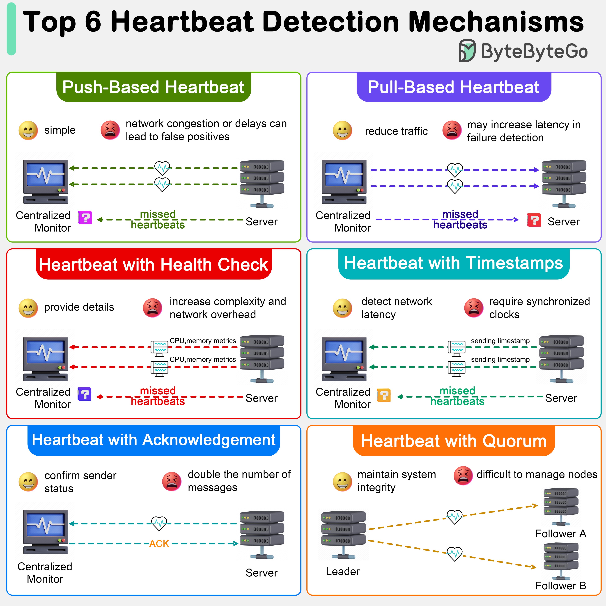

# 💓 分布式系统如何检测节点故障？6种心跳机制

> 节点挂了怎么发现？心跳检测是关键

6种常用的心跳检测机制 👇

1️⃣ **推送式心跳** — 节点定期发送信号，停止发送则认为故障。简单但网络拥塞可能误判

2️⃣ **拉取式心跳** — 中心监控定期拉取节点状态。减少网络流量但检测延迟增加

3️⃣ **带健康检查的心跳** — 心跳中包含CPU、内存等诊断信息，决策更精准

4️⃣ **带时间戳的心跳** — 判断节点是否存活的同时，还能发现网络延迟

5️⃣ **带确认的心跳** — 接收方必须回复确认，验证双向网络通路

6️⃣ **带仲裁的心跳** — 用于Paxos/Raft等共识协议，确保足够多节点在线才能做决策

💡 生产环境通常组合使用多种机制，避免单一方式的误判。

---

#分布式系统 #心跳检测 #高可用 #系统设计 #程序员 #技术干货
