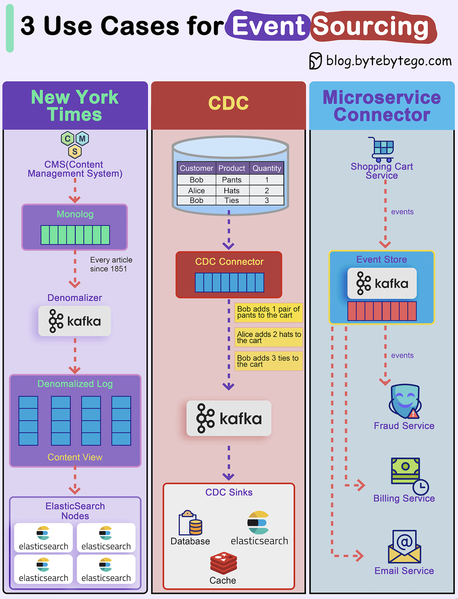

# 📜 事件溯源的3个实战案例！纽约时报、CDC、微服务

> 事件溯源不只是理论，大厂都在用

事件溯源把"存状态"变成"存事件"，事件存储是唯一真相源。3个实际案例 👇

📌 **纽约时报**
1851年至今的每篇文章、图片、署名都存在事件存储中，反范式化成不同视图，供ElasticSearch搜索

📌 **CDC（变更数据捕获）**
CDC连接器从表中拉取数据转换为事件，推送到Kafka，其他系统从Kafka消费

📌 **微服务连接器**
购物车服务生成添加/删除商品的事件，Kafka作为事件存储，风控、计费、邮件服务各自消费事件，自行决定领域模型

💡 事件溯源的核心优势：每个服务可以根据同一份事件数据构建自己的视图，真正实现解耦。

---

#事件溯源 #Kafka #微服务 #系统设计 #程序员 #技术干货
