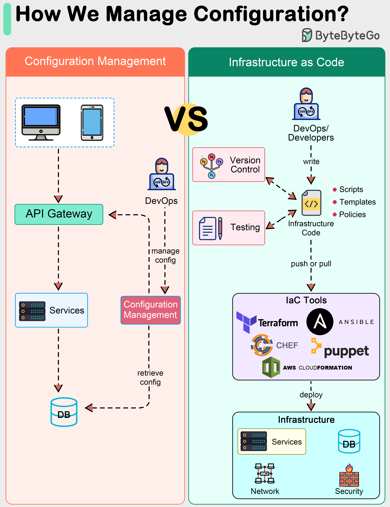

# ⚙️ 传统配置管理 vs 基础设施即代码！

> 从手动运维到代码化管理，效率质变

传统配置管理和IaC的对比 👇

📌 **传统配置管理**
- 初始手动设置
- 通过逐步命令管理变更
- 维护系统配置项的期望状态

📌 **基础设施即代码（IaC）**
- 用代码自动化基础设施配置
- 声明式描述期望状态
- 代码可版本控制、可测试、可复用
- 工具：Terraform、AWS CloudFormation、Chef、Puppet

💡 IaC是配置管理的进化，把软件开发实践应用到基础设施管理中。可重复、可审计、可回滚。

---

#IaC #配置管理 #DevOps #Terraform #程序员 #运维 #技术干货
