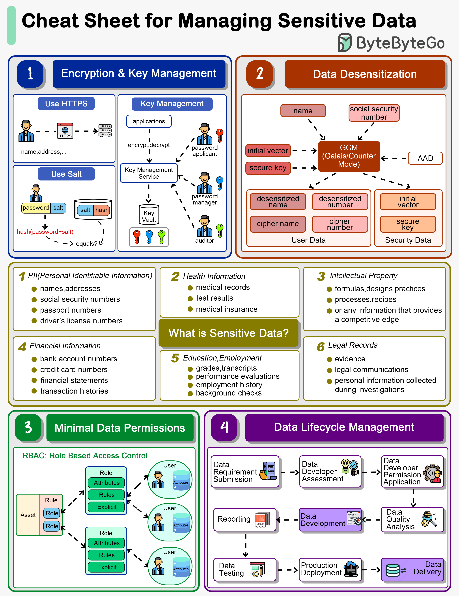

# 🔒 敏感数据管理速查表！从加密到脱敏全覆盖

> PII、健康信息、财务数据……保护不好就是法律风险

敏感数据包括PII、健康信息、知识产权、财务信息等。GDPR等法规要求严格保护 👇

🔑 **加密与密钥管理**
- SSL加密传输数据
- 密码不能明文存储
- 密钥分角色管理：申请人、管理员、审计员各持一把

🎭 **数据脱敏**
- 移除或修改个人信息，使个人无法被识别
- GCM等算法将密文和密钥分开存储

🔐 **最小权限原则**
- RBAC按角色授权，用户只能访问工作所需的数据

📋 **数据生命周期管理**
- 开发阶段授予必要权限
- 数据上线后撤销开发者的数据访问权限

💡 数据保护不是可选项，是法律要求。违规可能面临巨额罚款。

---

#数据安全 #GDPR #隐私保护 #程序员 #安全 #技术干货
