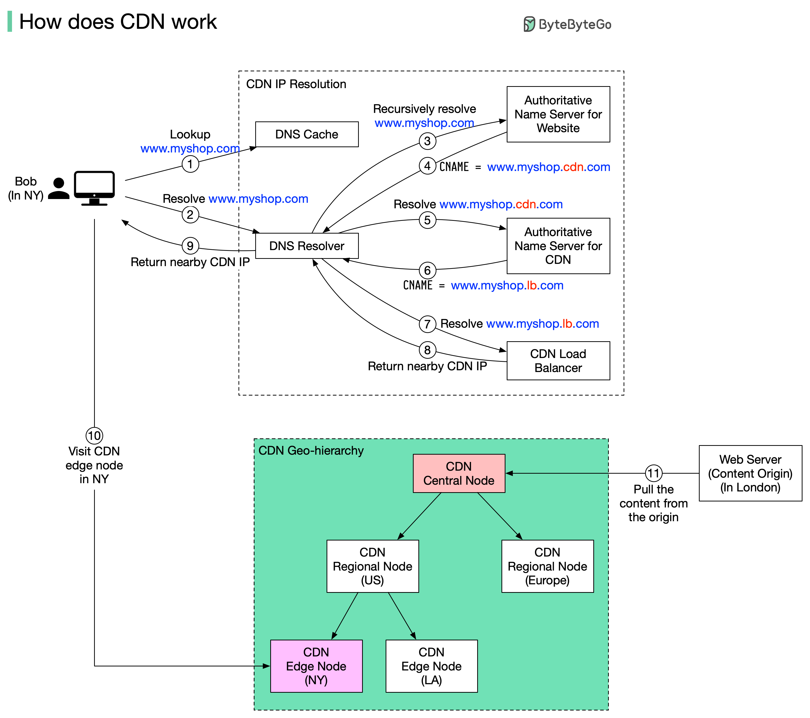

# 🌐 CDN是怎么工作的？从DNS解析到内容分发

> 纽约用户访问伦敦网站，CDN让延迟降到最低

Bob在纽约访问部署在伦敦的电商网站，CDN让内容从最近的服务器加载 👇

📌 **完整流程**
1. 浏览器查本地DNS缓存
2. 没命中则去DNS解析器（ISP提供）
3. 递归解析域名
4. 权威DNS返回CDN域名别名
5. 解析CDN域名
6. 返回CDN负载均衡器域名
7. CDN负载均衡器根据用户IP、ISP、内容、服务器负载选择最优边缘服务器
8. 返回边缘服务器IP
9. 浏览器访问CDN边缘服务器加载内容

📌 **CDN分发网络**
边缘CDN → 区域CDN → 中心CDN → 源站（伦敦服务器）

💡 CDN缓存静态内容（图片、CSS、JS）和动态内容（边缘计算结果）。

---

#CDN #网络 #性能优化 #Web开发 #程序员 #技术干货
