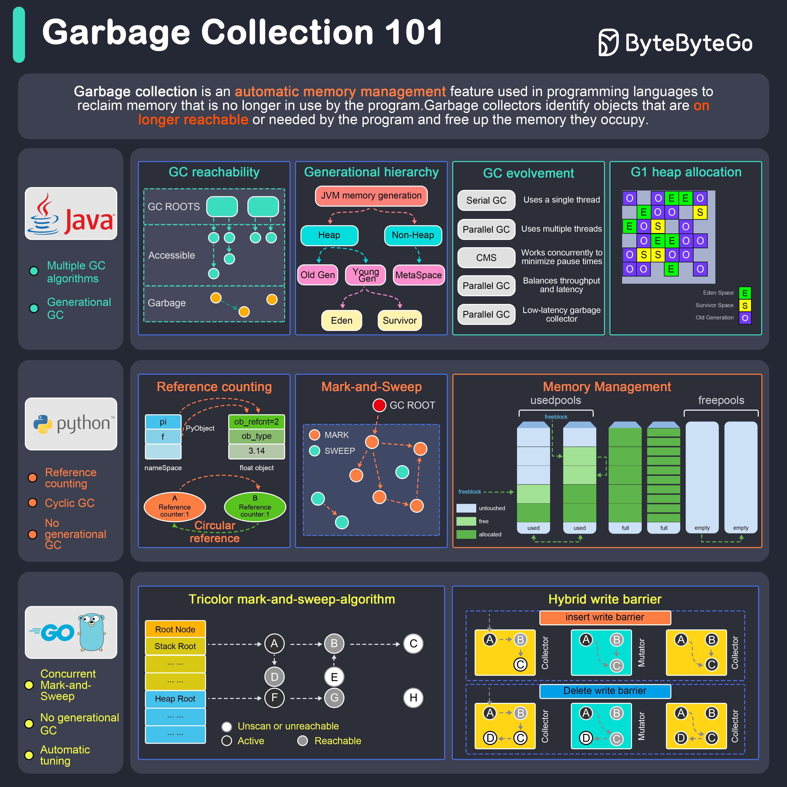

# 🗑️ 垃圾回收是怎么工作的？Java/Python/Go对比

> 自动内存管理的三种流派

三种语言的垃圾回收机制对比 👇

📌 **Java** — 多种GC可选
- Serial GC — 单线程，小应用
- Parallel GC — 吞吐量优先
- CMS — 低延迟
- G1 — 平衡吞吐量和延迟
- ZGC — 超低延迟，大堆内存

📌 **Python** — 引用计数+循环GC
- 引用计数：计数归零立即释放
- 循环GC：处理引用计数无法解决的循环引用

📌 **Go** — 并发标记清除
- 与应用并发运行，最小化STW暂停

💡 Java的GC最复杂但最灵活，Python最简单但有GIL限制，Go追求极致的低暂停时间。

---

#垃圾回收 #Java #Python #Go #程序员 #计算机基础 #技术干货
