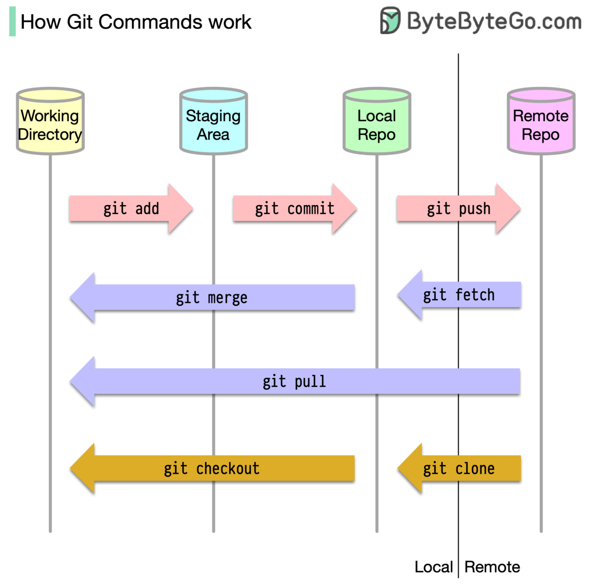

# 📂 Git的4个存储位置！代码到底存在哪？

> 不只是本地和远程，Git有4个存储位置

很多人以为代码只存在远程和本地两个地方，其实Git有4个存储位置 👇

📌 **工作目录** — 编辑文件的地方
📌 **暂存区** — 下次提交的文件临时存放处
📌 **本地仓库** — 已提交的代码
📌 **远程仓库** — 远程服务器上的代码

大多数Git命令就是在这4个位置之间移动文件。

💡 理解这4个位置的关系，是掌握Git的基础。

---

#Git #版本控制 #程序员 #开发工具 #技术干货
