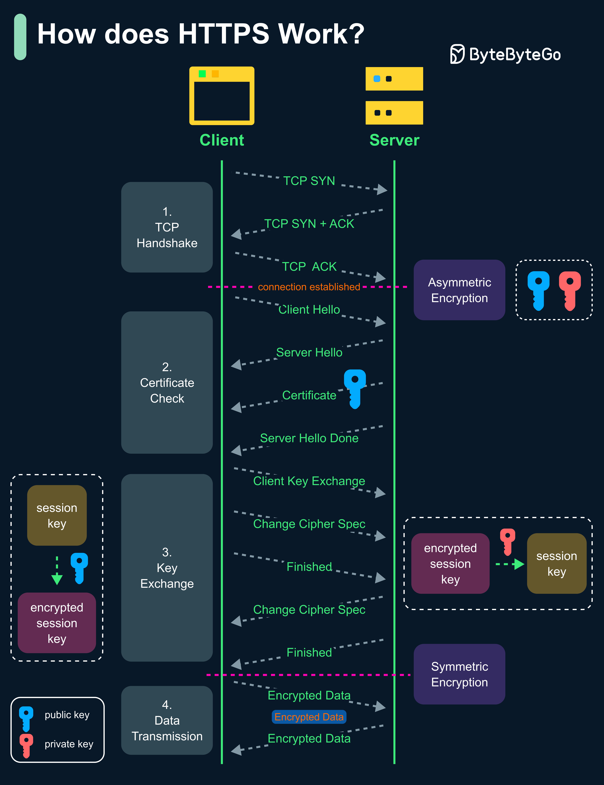

# 🔒 HTTPS是怎么工作的？4步建立安全连接

> 数据被劫持也只能看到二进制乱码

HTTPS用TLS加密传输数据，4步建立安全连接 👇

1️⃣ 客户端和服务器建立TCP连接

2️⃣ 客户端发送"client hello"（支持的加密算法和TLS版本），服务器回复"server hello"+SSL证书（含公钥）。客户端验证证书

3️⃣ 客户端生成会话密钥，用公钥加密后发送。服务器用私钥解密得到会话密钥

4️⃣ 双方用相同的会话密钥（对称加密）进行安全通信

📌 **为什么数据传输用对称加密？**
- 安全性：非对称加密是单向的，服务器用公钥加密的数据任何人都能解密
- 性能：非对称加密计算开销大，不适合长会话

💡 HTTPS = 非对称加密交换密钥 + 对称加密传输数据。兼顾安全和性能。

---

#HTTPS #安全 #加密 #Web开发 #程序员 #技术干货
