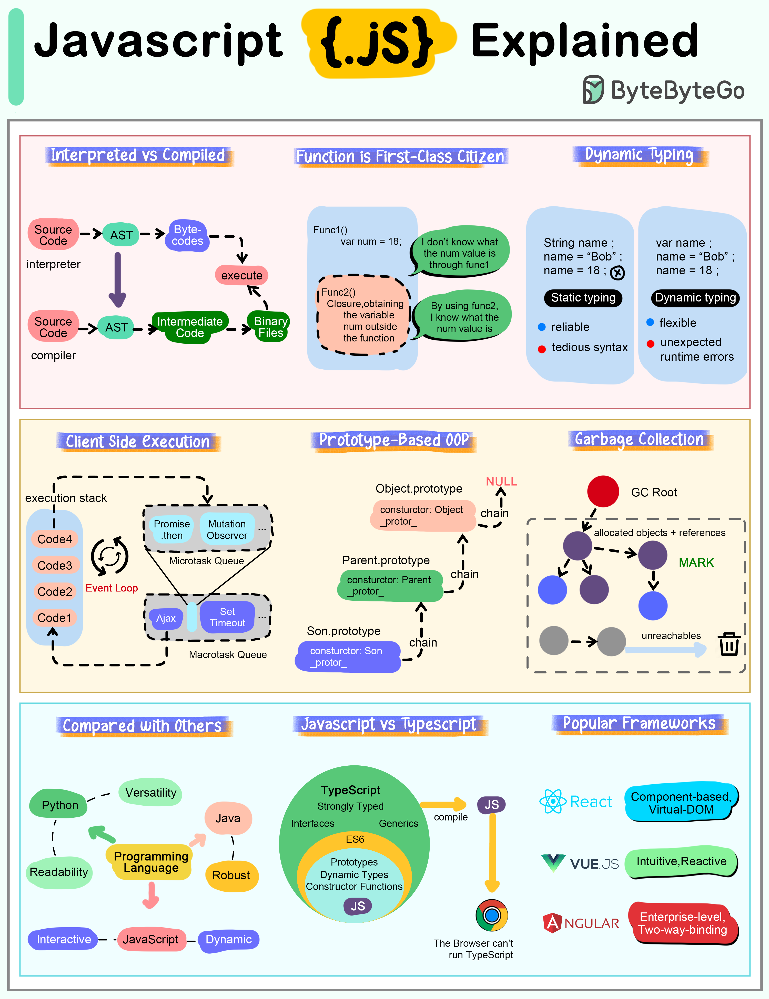

# 💛 JavaScript核心特性速览！前端开发的灵魂语言

> 从解释执行到原型继承，JS的独特之处

JavaScript最重要的特性一览 👇

📌 **解释型语言** — 浏览器或JS引擎直接执行，V8用JIT编译提速
📌 **函数是一等公民** — 可以存变量、传参数、作为返回值
📌 **动态类型** — 不需要声明变量类型，运行时可变
📌 **客户端执行** — 支持异步编程（回调、Promise），提升性能和体验
📌 **原型继承** — 不是基于类，而是对象从其他对象继承
📌 **自动垃圾回收** — 自动回收不再使用的内存

📌 **与TypeScript的关系**
TypeScript是JS的超集，添加了类型注解。所有合法的JS代码也是合法的TS代码

📌 **流行框架**
React（灵活）、Vue（简洁）、Angular（企业级）

💡 JS是唯一能同时在浏览器和服务器（Node.js）运行的主流语言，这是它独特的优势。

---

#JavaScript #前端 #编程 #程序员 #Web开发 #技术干货
