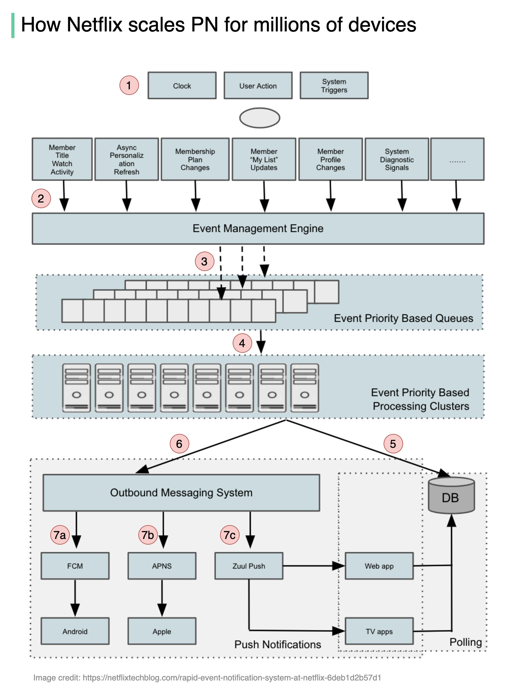

# 🎬 Netflix如何为2.2亿用户推送消息？

> 覆盖iOS、Android、智能电视、Roku等所有设备

Netflix 2.2亿用户的推送消息系统架构 👇

📌 **推送通知的生命周期**
1. 事件由定时器、用户操作或系统触发
2. 发送到事件管理引擎
3. 引擎监听特定事件，按优先级规则转发到不同队列
4. 优先级处理集群处理事件，生成推送数据
5. Cassandra存储通知数据
6. 发送到出站消息系统
7. 投递渠道：
   - Android → FCM
   - Apple → APNs
   - Web/TV/流媒体设备 → Netflix自研的Zuul Push

💡 Netflix为Web和TV设备自研了Zuul Push，因为这些设备没有统一的推送服务。

---

#Netflix #推送通知 #系统设计 #大厂案例 #程序员 #技术干货
