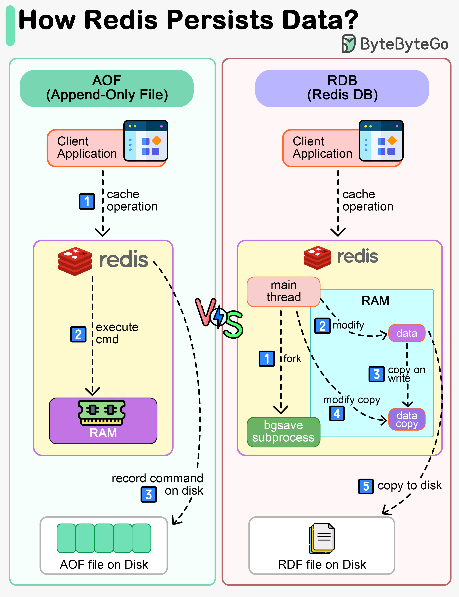

# 💾 Redis数据持久化！AOF vs RDB vs 混合模式

> 内存数据库宕机了数据怎么办？

Redis是内存数据库，服务器宕机数据就丢了。两种持久化方式 👇

📌 **AOF（追加日志文件）**
- 先执行命令修改内存数据，再写日志
- 记录的是命令而非数据
- 恢复时需要扫描整个日志，大日志恢复慢

📌 **RDB（快照）**
- 在特定时间点记录数据快照
- 恢复时直接加载到内存，速度快
- 主线程fork子进程bgsave写RDB文件
- 写入期间主线程修改数据时用COW（写时复制）

📌 **混合模式（生产推荐）**
- RDB定期做快照
- AOF记录快照之后的命令
- 兼顾恢复速度和数据完整性

💡 生产环境推荐混合模式：RDB保证快速恢复，AOF保证数据不丢失。

---

#Redis #持久化 #缓存 #后端开发 #程序员 #技术干货
