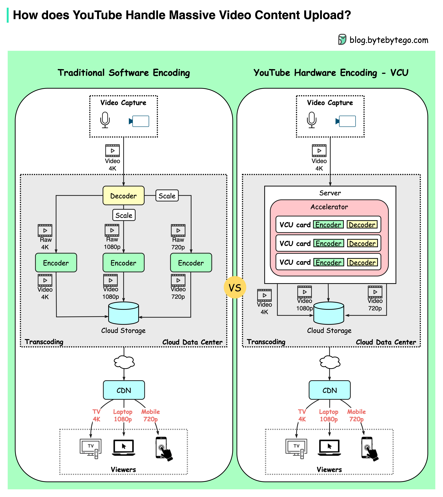

# 📹 YouTube如何处理每分钟500+小时的视频上传？

> 自研VCU硬件编码器，效率提升20-33倍

YouTube每分钟平均500+小时视频上传，怎么扛住的？👇

📌 **传统软件编码的问题**
YouTube需要把原始视频转码成不同压缩率（720p/1080p/4K）。疫情期间视频消费暴增，软件编码变得又慢又贵

📌 **YouTube的转码大脑：VCU**
类似GPU用于图形、TPU用于机器学习，YouTube开发了VCU（视频转码单元）：
- 每个集群有多台VCU加速服务器
- 每台服务器有多个加速托盘
- 每个托盘有多张VCU卡（含编码器、解码器）

📌 **效果**
比之前优化过的系统提升20-33倍计算效率

💡 当软件优化到极限时，就该考虑硬件加速了。这是YouTube的工程哲学。

---

#YouTube #视频编码 #硬件加速 #大厂案例 #程序员 #技术干货
