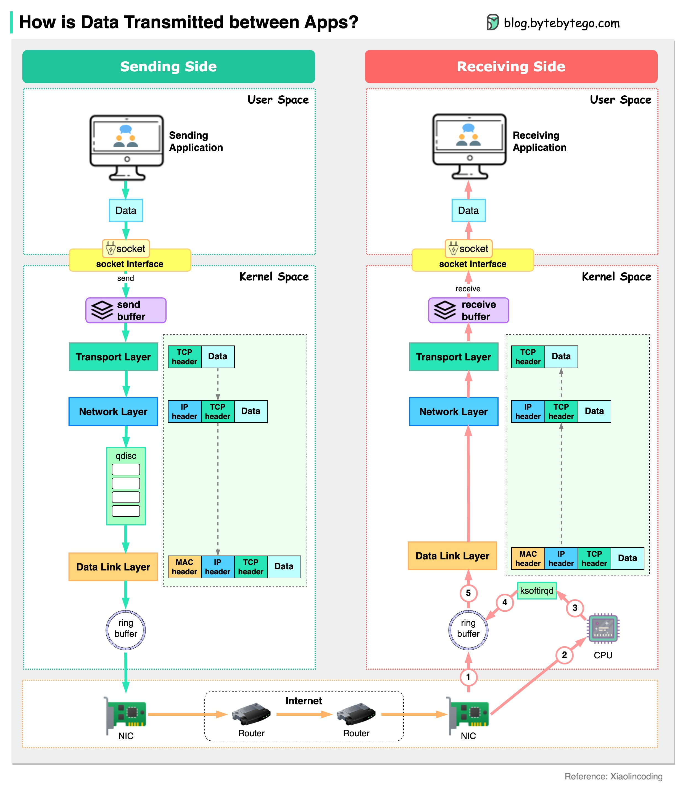

# 📡 应用之间的数据是怎么传输的？从用户空间到网卡

> 一条聊天消息从发送到接收，经历了多少层

服务器之间数据传输的完整过程 👇

📌 **发送端**
1. 聊天应用（用户空间）发送消息
2. 数据进入内核空间的发送缓冲区
3. 经过网络栈：加TCP头→加IP头→加MAC头
4. 通过qdisc（排队规则）做流量控制
5. 通过环形缓冲区发送到网卡（NIC）
6. 网卡发送到互联网

📌 **接收端**
1. 网卡接收数据放入环形缓冲区
2. 发送硬中断给CPU
3. CPU发送软中断，ksoftirqd从环形缓冲区接收数据
4. 数据经过数据链路层→网络层→传输层逐层解包
5. 数据复制到用户空间，到达聊天应用

💡 理解这个过程有助于排查网络性能问题，每一层都可能成为瓶颈。

---

#网络 #数据传输 #Linux #计算机基础 #程序员 #技术干货
