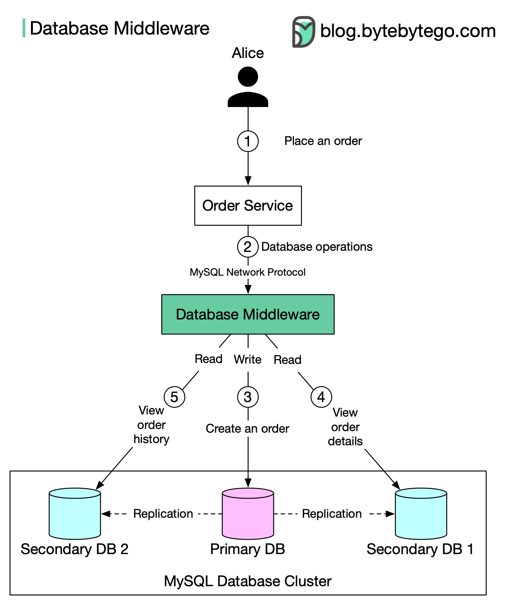

# 📖 读副本模式实现！用中间件透明路由读写

> 应用不用关心数据库拓扑，中间件搞定一切

用数据库中间件实现读写分离 👇

📌 **流程**
1. Alice下单 → 订单服务
2. 订单服务发查询到数据库中间件（不直接连数据库）
3. 中间件将写操作路由到主库，数据复制到两个副本
4-5. Alice查看订单详情和历史（读操作）通过中间件路由到副本

📌 **优点**：应用代码简化，兼容性好（MySQL标准协议）
📌 **缺点**：系统复杂度增加，额外网络延迟

💡 中间件方案适合大型系统，小项目在应用层做路由更简单。

---

#读写分离 #数据库 #MySQL #后端开发 #程序员 #技术干货
