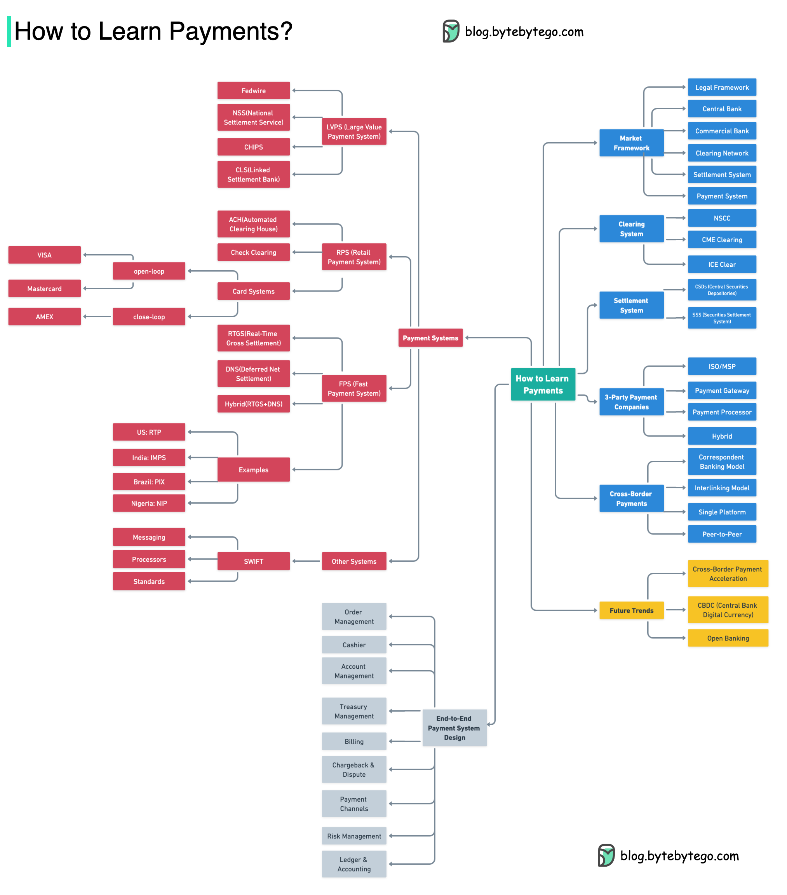

# 💰 支付行业学习指南！从监管到清算全景图

> 想做支付系统？先了解整个行业的全貌

支付行业的全景知识图谱 👇

📌 **行业组成**
- 监管机构
- 中央银行
- 商业银行
- 非银行支付公司
- 支付系统
- 清算网络
- 结算系统

📌 **推荐学习资料**
- GlenBrook《Payment Systems in the U.S.》
- BIS（国际清算银行）网站
- PayPal/Stripe/SWIFT文档

💡 不同国家有不同的支付框架，但基本组成部分是相似的。先建立全局视角，再深入具体领域。

---

#支付 #金融科技 #学习路线 #程序员 #后端开发 #技术干货
