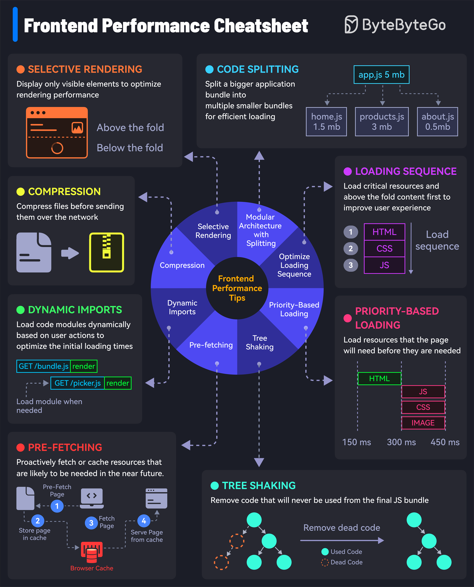

# ⚡ 前端性能优化8大技巧！让网站飞起来

> 加载速度每快1秒，转化率提升7%

8个提升前端性能的技巧 👇

1️⃣ **压缩** — 压缩文件，减少传输数据量
2️⃣ **选择性渲染/虚拟列表** — 只渲染可见元素
3️⃣ **代码分割** — 大Bundle拆成多个小Bundle按需加载
4️⃣ **优先级加载** — 优先加载关键资源和首屏内容
5️⃣ **预加载** — 提前获取即将需要的资源
6️⃣ **Tree Shaking** — 移除永远不会执行的死代码
7️⃣ **预获取** — 主动缓存可能很快需要的资源
8️⃣ **动态导入** — 根据用户操作动态加载代码模块

💡 性能优化的80/20法则：代码分割+压缩+懒加载这三个就能解决大部分性能问题。

---

#前端 #性能优化 #Web开发 #程序员 #技术干货
