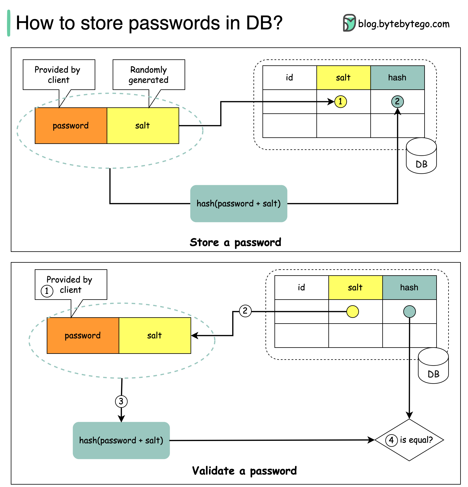

# 🔑 密码应该怎么存？加盐哈希是标准做法

> 明文存密码是大忌，直接哈希也不够安全

密码安全存储的正确方式 👇

❌ **不要做的事**
- 明文存储：任何有内部访问权限的人都能看到
- 直接哈希：容易被彩虹表攻击

✅ **正确做法：加盐哈希**

📌 **什么是盐（Salt）？**
一个唯一的随机字符串，在哈希过程中添加到每个密码中

📌 **存储格式**
hash(password + salt)，盐可以明文存储

📌 **验证流程**
1. 用户输入密码
2. 系统从数据库获取对应的盐
3. 密码+盐做哈希得到H1
4. 比较H1和数据库中存储的H2
5. 相同则密码正确

💡 盐不需要保密，它的作用是确保每个密码的哈希结果都是唯一的，即使两个用户用了相同的密码。

---

#密码安全 #安全 #数据库 #后端开发 #程序员 #技术干货
