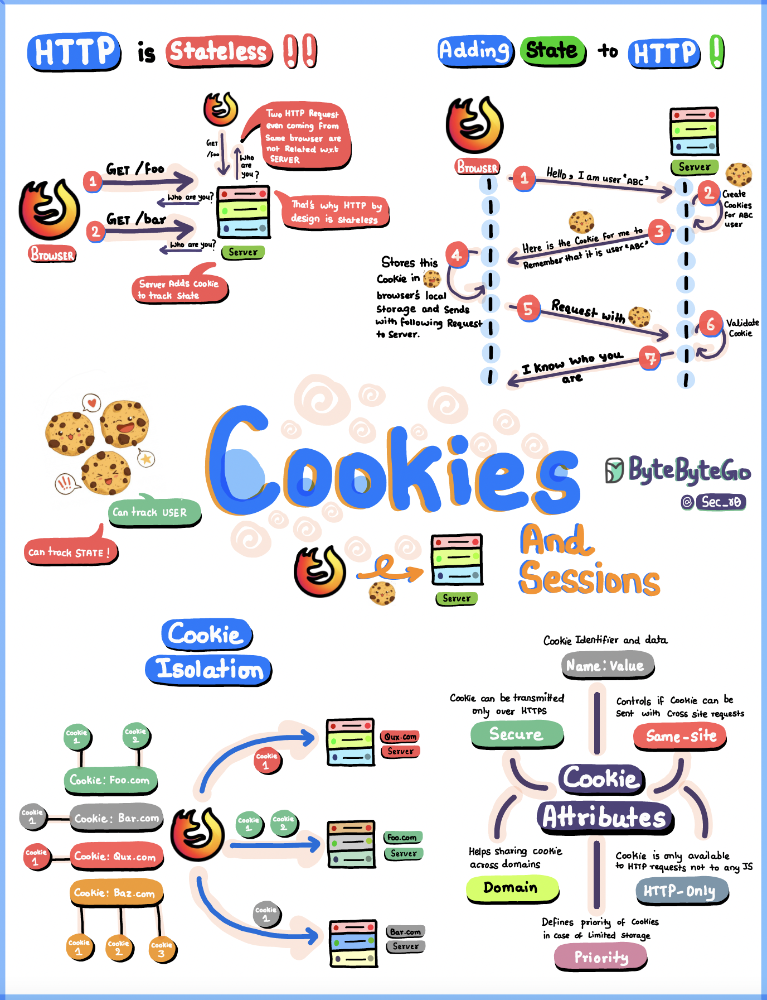

# 🍪 一张图搞懂 HTTP Cookie！网站是怎么"记住"你的？

> HTTP本身没有记忆，Cookie就是它的"小纸条"

HTTP协议天生是 **无状态** 的，就像一条金鱼，转头就忘了你是谁 🐟

那网站怎么记住你的登录状态、购物车信息？靠的就是 **Cookie** 👇

📌 **Cookie 是什么？**
就是浏览器存在本地的一小段数据，每次请求时自动带给服务器，相当于跟服务器说："记住我！"

📌 **浏览器的角色**
浏览器就像 Cookie 的保安，确保你的 Cookie 不会被发送到错误的网站

📌 **Cookie 的关键属性：**
- **Name / Value** — Cookie 的名字和值，核心数据
- **Domain** — 指定哪个域名可以访问这个 Cookie
- **Secure** — 只在 HTTPS 下传输
- **HttpOnly** — JS 无法读取，防 XSS 攻击
- **SameSite** — 防止跨站请求伪造（CSRF）

💡 Cookie 虽小，但安全属性设置不当就是漏洞。写代码时一定要注意这几个属性的配置。

你平时开发中踩过 Cookie 的坑吗？评论区分享下 👇

---

#HTTP #Cookie #Web开发 #前端 #网络安全 #浏览器 #面试
