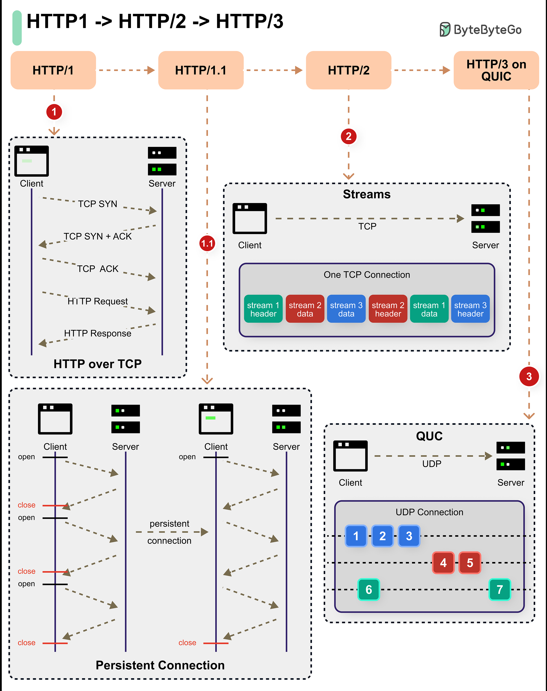

# 🚀 HTTP协议进化史！从HTTP/1到HTTP/3到底快在哪？

> 一张图看懂三代HTTP协议的核心区别

HTTP协议已经迭代了三代，每一代都在解决上一代的痛点 👇

📌 **HTTP/1（1996年）**
- 引入持久连接、管道化、请求头
- 基于 **TCP**，可靠但慢
- 一个连接同时只能处理一个请求（队头阻塞）

📌 **HTTP/2（2015年）**
- **多路复用** — 一个连接并行处理多个请求，告别队头阻塞
- **服务器推送** — 服务器主动推资源，不用等客户端请求
- **HPACK压缩** — 头部压缩，减少传输体积
- **流优先级** — 重要资源优先传输
- 底层还是 TCP

📌 **HTTP/3（2019年）**
- 底层换成了 **QUIC**（基于UDP）
- 彻底解决 TCP 层面的队头阻塞
- 连接建立更快（0-RTT）
- 自带加密，安全性更强

💡 **一句话总结：**
HTTP/1 → 能用，HTTP/2 → 更快，HTTP/3 → 又快又稳

你的项目用的是哪个版本？评论区聊聊 👇

---

#HTTP #网络协议 #HTTP2 #HTTP3 #QUIC #后端 #Web开发 #面试
