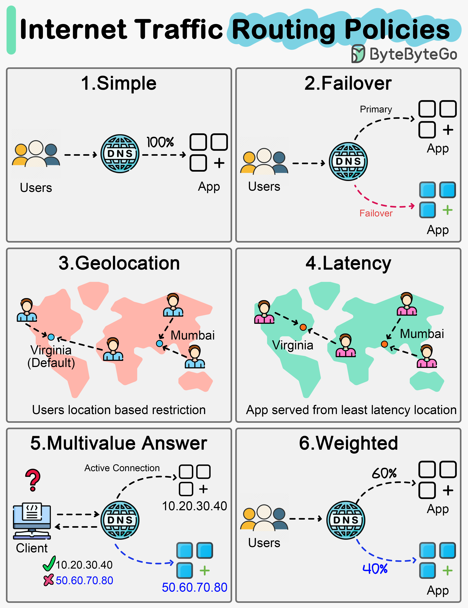

# 🌐 6种DNS流量路由策略！你的请求是怎么被分配的？

> 一图看懂互联网流量是如何被智能调度的

用户的请求到底是怎么被分配到不同服务器的？靠的就是 **DNS路由策略** 👇

📌 **Simple（简单路由）**
所有流量指向一个端点，最基础的方式

📌 **Failover（故障转移）**
流量默认走主节点，主节点挂了自动切到备用节点 🔄

📌 **Geolocation（地理位置）**
根据用户所在地区分配流量，北京用户访问北京服务器，纽约用户访问纽约服务器 🗺️

📌 **Latency（延迟优先）**
哪个节点响应最快就把流量导向哪里，用户体验拉满 ⚡

📌 **Multivalue Answer（多值应答）**
返回多个IP地址，让客户端自己选。注意：不能替代负载均衡器

📌 **Weighted（加权路由）**
按权重比例分配流量，比如80%走A服务器，20%走B服务器，灰度发布必备

💡 实际生产中这些策略经常组合使用，根据业务场景灵活搭配。

你们项目用的哪种路由策略？👇

---

#DNS #路由策略 #负载均衡 #系统设计 #云计算 #后端 #运维
