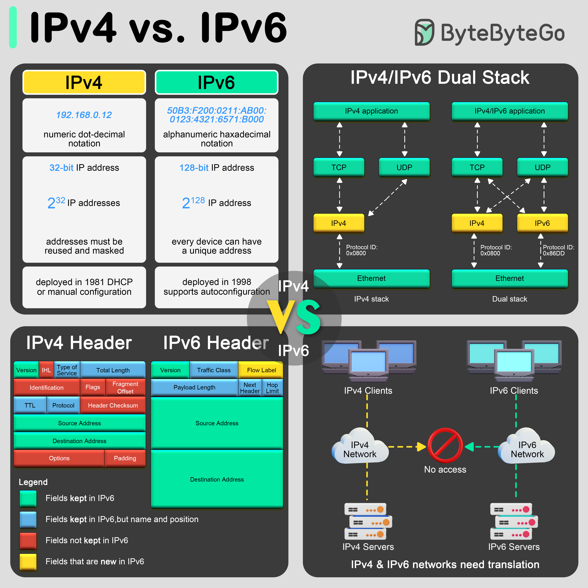

# 🔢 IPv4 vs IPv6！为什么IP地址要升级？

> 一张图搞懂两代IP协议的核心区别

IPv4 的地址快用完了，IPv6 就是来救场的 👇

📌 **地址格式**
- **IPv4**：32位，4组十进制数，如 `192.168.0.12`，约43亿个地址
- **IPv6**：128位，8组十六进制数，如 `50B3:F200:0211:AB00:...`，地址数量多到用不完

📌 **报头差异**
- **IPv4 报头**：复杂，包含校验和、分片信息等多个字段
- **IPv6 报头**：固定40字节，更简洁高效，不常用的字段放到扩展头里，处理速度更快

📌 **过渡方案**
IPv4 和 IPv6 要共存很长时间，怎么办？
- **双栈（Dual Stack）** — 设备同时运行两种协议，根据目标地址自动选择，是目前最推荐的过渡方案

💡 **为什么 IPv4 不够用？**
43亿个地址听起来很多，但全球联网设备早就超过这个数了。手机、电脑、IoT设备……每个都需要IP地址。

你的网络环境已经支持 IPv6 了吗？👇

---

#IPv4 #IPv6 #网络协议 #计算机网络 #互联网 #程序员 #面试
