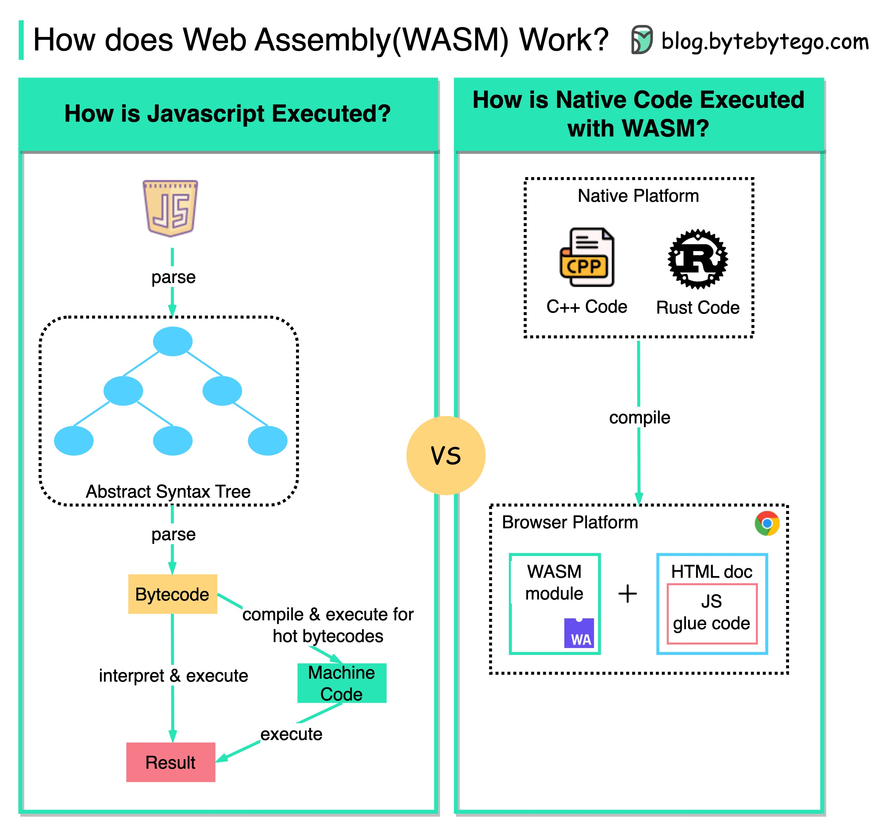

# ⚡ 浏览器里跑C++/Rust？WebAssembly了解一下！

> WASM让Web应用拥有接近原生的性能

以前浏览器里只能跑 JavaScript，性能跟原生代码没法比。但 **WebAssembly（WASM）** 改变了这一切 👇

📌 **WASM 是什么？**
一种可以在浏览器中运行的二进制指令格式，让 C/C++/Rust 等语言编写的代码直接在浏览器里跑

📌 **怎么工作的？**
- 用 C/C++/Rust 写好代码
- 编译成 WASM 格式
- 浏览器加载并执行，性能接近原生

📌 **能干什么？**
- 在浏览器里跑 **视频编解码**（C++写的库直接复用）
- 图像处理、3D渲染、游戏引擎
- 复杂计算任务

📌 **更大的想象空间**
- **云计算** — 用更少的资源跑 Serverless 应用
- **边缘计算** — 即时启动，超低延迟
- 复用已有的原生代码库，不用重写

💡 WASM 不是要取代 JavaScript，而是在性能敏感的场景做补充。两者配合才是最佳实践。

你用过 WASM 吗？评论区聊聊体验 👇

---

#WebAssembly #WASM #Rust #C++ #前端 #性能优化 #边缘计算 #程序员
