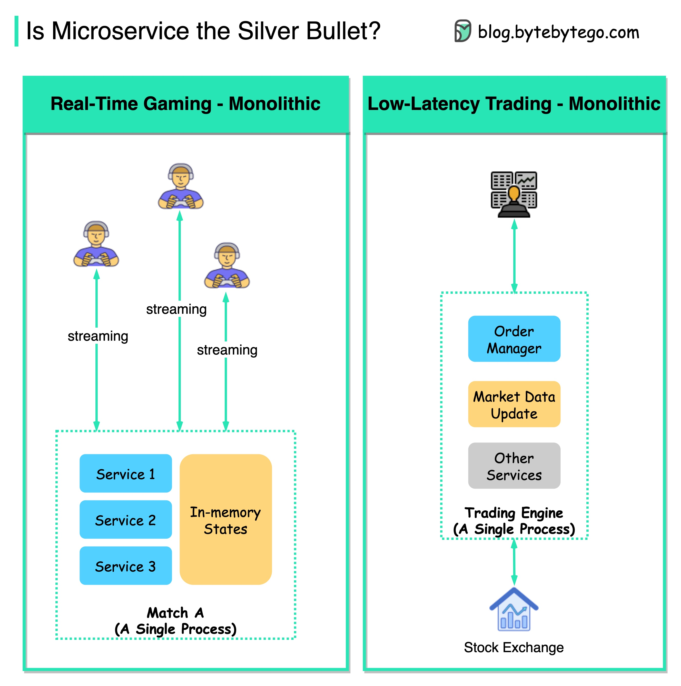

# 🎯 微服务不是银弹！这些场景千万别用微服务

> 实时游戏和低延迟交易为什么选单体架构？

微服务很火，但不是万能的。**实时游戏** 和 **低延迟交易** 就不适合用微服务 👇

📌 **延迟要求极高**
- 实时游戏：延迟要在 **毫秒级**
- 低延迟交易：延迟要在 **微秒级**
- 微服务拆成不同进程后，网络通信的延迟根本无法接受

📌 **状态必须在内存中**
- 微服务通常是无状态的，状态存数据库
- 但游戏角色受伤了，你不能等3秒才看到血量变化
- 这类应用必须把状态 **存在内存** 里实时更新

📌 **高频通信 + 粘性连接**
- 客户端需要高频和服务器通信
- 请求必须打到同一个实例上
- 需要 **WebSocket** 长连接和 **粘性路由**

💡 **核心启示：**
架构选型要问"为什么"，而不是"什么火用什么"。微服务解决的是特定领域的问题，不是所有场景都适用。

你的项目适合微服务还是单体？👇

---

#微服务 #单体架构 #系统设计 #架构设计 #游戏开发 #后端 #面试
