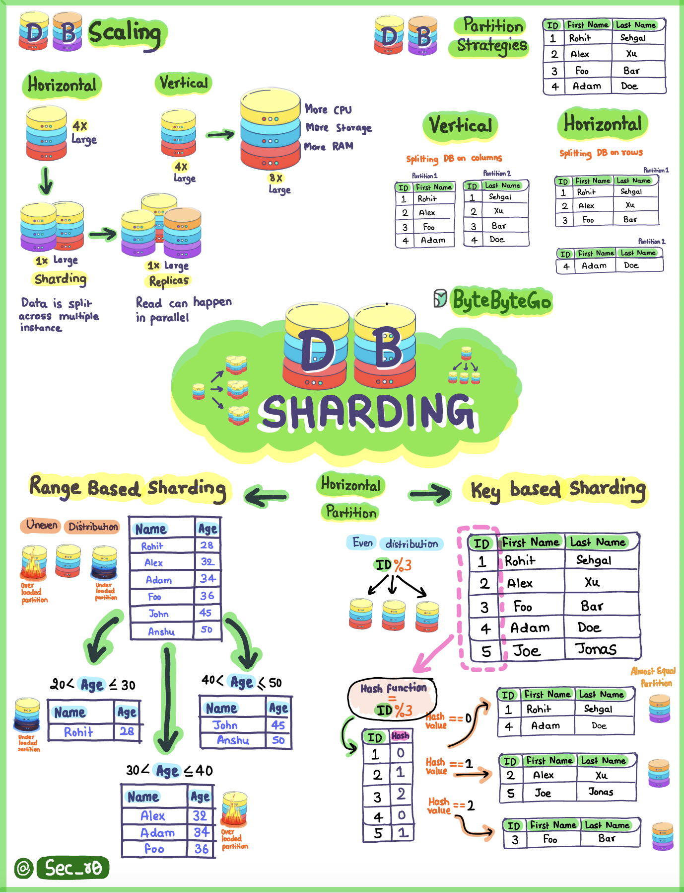

# 🗂️ 数据库分片必懂的3种策略！

> 数据量太大一张表扛不住？分片来帮你

数据库分片就是把一张大表的数据拆分到多个数据库实例上，三种常见策略 👇

📌 **范围分片（Range-Based）**
按数据范围拆分，比如按时间、按ID区间。就像把书按类型放到不同书架上 📚

📌 **哈希分片（Key-Based）**
对数据的Key做哈希运算，按结果分配到不同分片。就像按花色和数字给扑克牌分类 🃏

📌 **目录分片（Directory-Based）**
用一个目录表记录数据在哪个分片，查目录就能快速定位。就像电话簿一样 📖

💡 **怎么选？**
- 数据有天然范围（时间/地区）→ 范围分片
- 需要均匀分布 → 哈希分片
- 分片规则复杂多变 → 目录分片

分片虽好，但也带来了跨分片查询、数据迁移等挑战，别盲目上。

你们项目用的哪种分片策略？👇

---

#数据库 #分片 #分库分表 #系统设计 #后端 #架构 #面试
