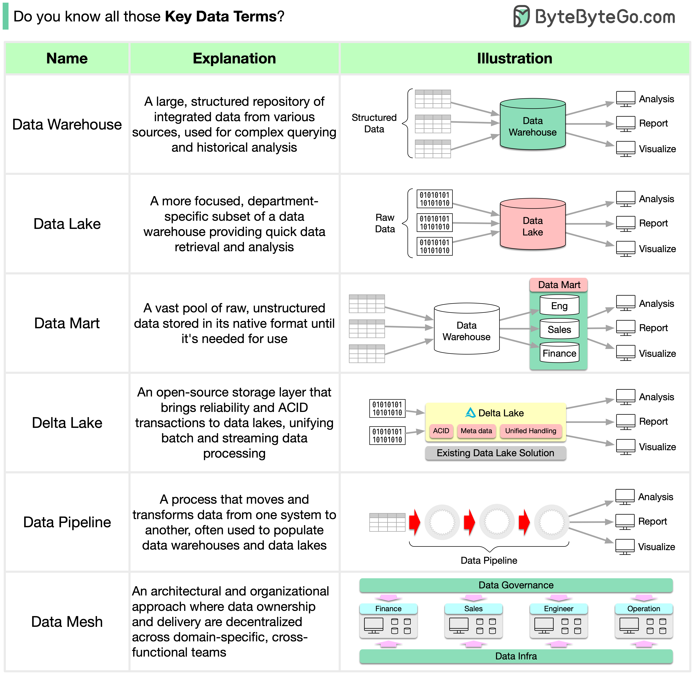

# 📊 6个数据领域核心术语！搞大数据必须知道

> 数据仓库、数据湖、数据管道……一次搞清楚

数据无处不在，但这些常用术语你都分得清吗？👇

📌 **Data Warehouse（数据仓库）**
来自多个数据源的结构化数据集中存储，用于复杂查询和历史分析

📌 **Data Mart（数据集市）**
数据仓库的子集，面向特定部门，查询更快更聚焦

📌 **Data Lake（数据湖）**
海量原始数据以原始格式存储，结构化/非结构化都往里扔，用的时候再处理

📌 **Delta Lake（增量湖）**
开源存储层，给数据湖加上 ACID 事务和可靠性，统一批处理和流处理

📌 **Data Pipeline（数据管道）**
把数据从一个系统搬到另一个系统的过程，中间可以做清洗和转换

📌 **Data Mesh（数据网格）**
去中心化的数据架构，数据所有权分散到各业务域团队，每个团队管自己的数据

💡 简单记：仓库存整理好的，湖里存原始的，管道负责搬运，网格负责分权。

你在工作中接触最多的是哪个？👇

---

#大数据 #数据仓库 #数据湖 #数据工程 #后端 #架构 #程序员
