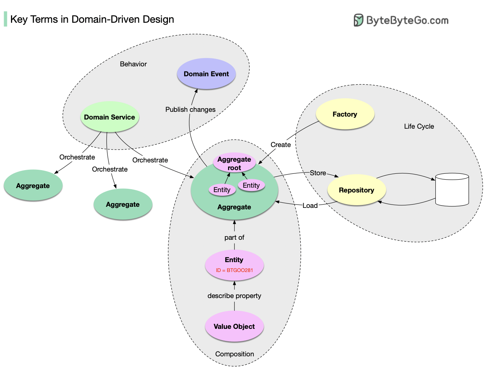

# 🏗️ DDD领域驱动设计核心术语！复杂业务建模必备

> 实体、值对象、聚合根……一张图全搞定

DDD 是处理复杂业务系统的利器，来自 Eric Evans 的经典著作。核心概念分三层 👇

📌 **领域对象的组成：**
- **Entity（实体）** — 有唯一ID和生命周期的领域对象
- **Value Object（值对象）** — 没有ID，用来描述实体的属性
- **Aggregate（聚合）** — 一组实体的集合，由聚合根绑定在一起，是存储的基本单位

📌 **领域对象的生命周期：**
- **Repository（仓储）** — 负责聚合的存储和加载
- **Factory（工厂）** — 负责聚合的创建

📌 **领域对象的行为：**
- **Domain Service（领域服务）** — 协调多个聚合的操作
- **Domain Event（领域事件）** — 描述聚合发生了什么，公开发布供其他模块消费

💡 DDD 的核心思想：让代码结构和业务模型保持一致，业务怎么说，代码就怎么写。

你在项目中实践过 DDD 吗？最大的挑战是什么？👇

---

#DDD #领域驱动设计 #架构设计 #软件设计 #后端 #微服务 #面试
