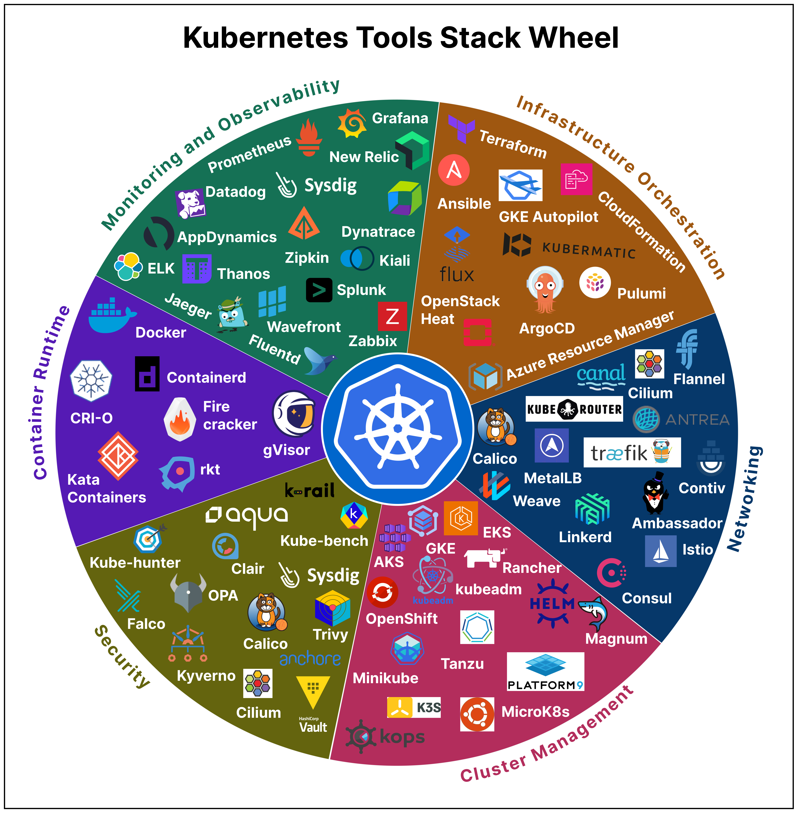

# 🎡 K8s工具栈轮盘！选工具不再纠结

> 一张轮盘图帮你快速选择K8s工具组合

K8s 工具太多，选择困难症犯了？这张工具栈轮盘帮你理清思路 👇

📌 **为什么需要这张图？**
- K8s 工具不断演进，新工具层出不穷
- 光了解现有工具就是一项大工程
- 需要根据场景选择合适的工具组合

📌 **怎么用？**
- 按你的使用场景找到对应分类
- 对比同类工具的特点
- 选择最适合你团队的组合

💡 没有万能的工具组合，关键是匹配你的实际需求。收藏这张图，选工具时拿出来参考。

你们的 K8s 工具栈是怎么搭的？👇

---

#Kubernetes #K8s #DevOps #工具 #云原生 #容器编排 #运维
