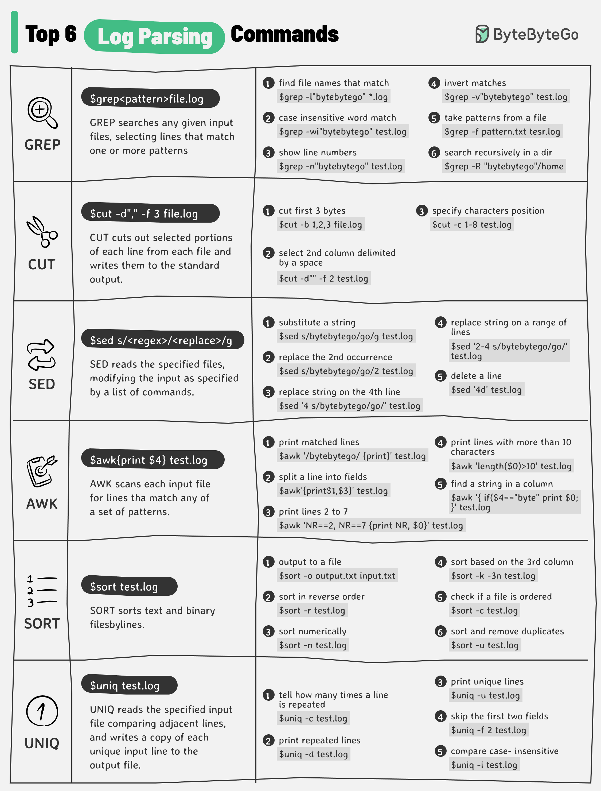

# 📋 日志分析6大命令速查表！运维排障必备

> grep、awk、sed……组合使用威力翻倍



线上出问题第一件事就是看日志，这6个命令必须熟练 👇

📌 **GREP** — 按模式搜索匹配的行
📌 **CUT** — 截取每行的指定部分
📌 **SED** — 按规则修改输入内容
📌 **AWK** — 按模式扫描并处理每行
📌 **SORT** — 按行排序
📌 **UNIQ** — 去除相邻重复行

📌 **组合使用示例：**
查找 xxService 异常发生的时间戳：
```bash
grep "xxService" service.log | grep "Exception" | cut -d" " -f 2
```

💡 这些命令单独用一般般，组合起来才是真正的排障利器。管道符 `|` 是灵魂。

你最常用的日志分析命令组合是什么？👇

---

#Linux #日志分析 #运维 #命令行 #grep #awk #程序员 #DevOps
