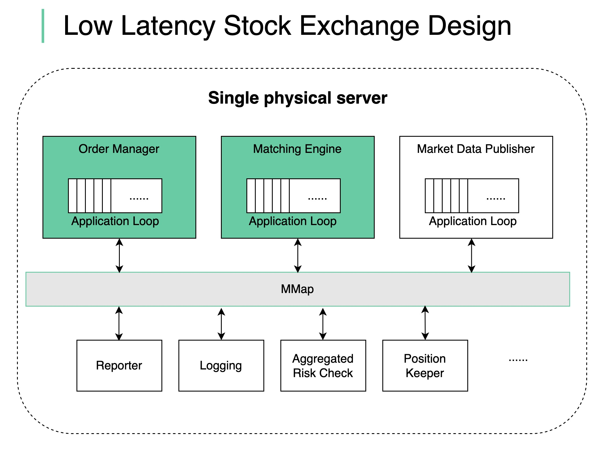

# ⚡ 证券交易所如何实现微秒级延迟？

> 核心原则：在关键路径上做更少的事

现代证券交易所怎么做到 **微秒级延迟**？核心就一句话：**在关键路径上做更少的事** 👇

📌 **减少关键路径的原则：**
- 更少的任务
- 每个任务更短的耗时
- 更少的网络跳转
- 更少的磁盘使用

📌 **关键路径是什么？**
订单进入 → 风控检查 → 撮合匹配 → 执行结果返回

📌 **架构设计要点：**

🔹 所有组件部署在 **一台巨型服务器** 上（不用容器）
🔹 用 **共享内存** 作为事件总线通信（不用硬盘）
🔹 核心组件（订单管理器、撮合引擎）**单线程**，绑定到固定CPU核心
🔹 **无上下文切换、无锁**
🔹 单线程应用循环按顺序逐个执行任务
🔹 其他组件监听事件总线，异步响应

💡 这就是为什么低延迟交易不用微服务的原因——网络通信的开销在微秒级场景下是不可接受的。

你对高频交易系统感兴趣吗？👇

---

#交易所 #低延迟 #系统设计 #高频交易 #架构 #后端 #面试
