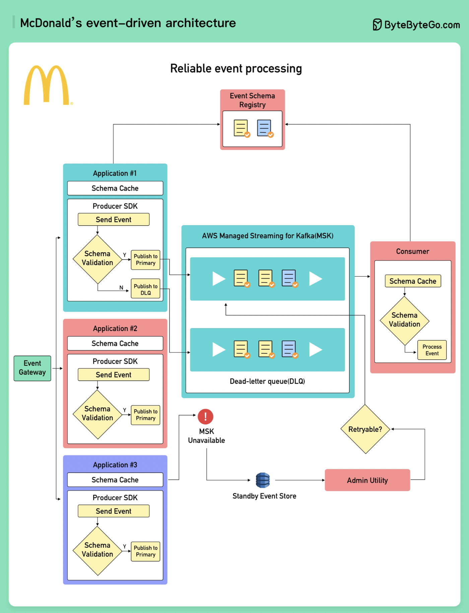

# 🍔 麦当劳的事件驱动架构！没想到吧？

> 全球快餐巨头背后的技术架构揭秘

你以为麦当劳只会做汉堡？人家的技术架构也很硬核 👇

📌 **事件标准化四大组件：**
- **Event Registry（事件注册中心）** — 定义标准化的事件Schema
- **Custom SDKs** — 自定义SDK处理事件和错误
- **Event Gateway（事件网关）** — 身份认证和授权
- **Utilities & Tools** — 修复事件、维护集群健康

📌 **如何扩展事件处理？**
- 采用 **区域架构**，基于AWS实现全球可用
- 生产者按业务域分片事件
- 每个域由一个 **MSK集群** 处理
- 基于MSK指标（如CPU使用率）**自动扩缩容**
- 扩缩容工作流基于 Step Functions

💡 麦当劳的案例说明：事件驱动架构不只是互联网公司的专利，传统行业一样可以用得很好。

你还知道哪些传统企业的技术架构案例？👇

---

#麦当劳 #事件驱动 #架构 #AWS #Kafka #系统设计 #案例
