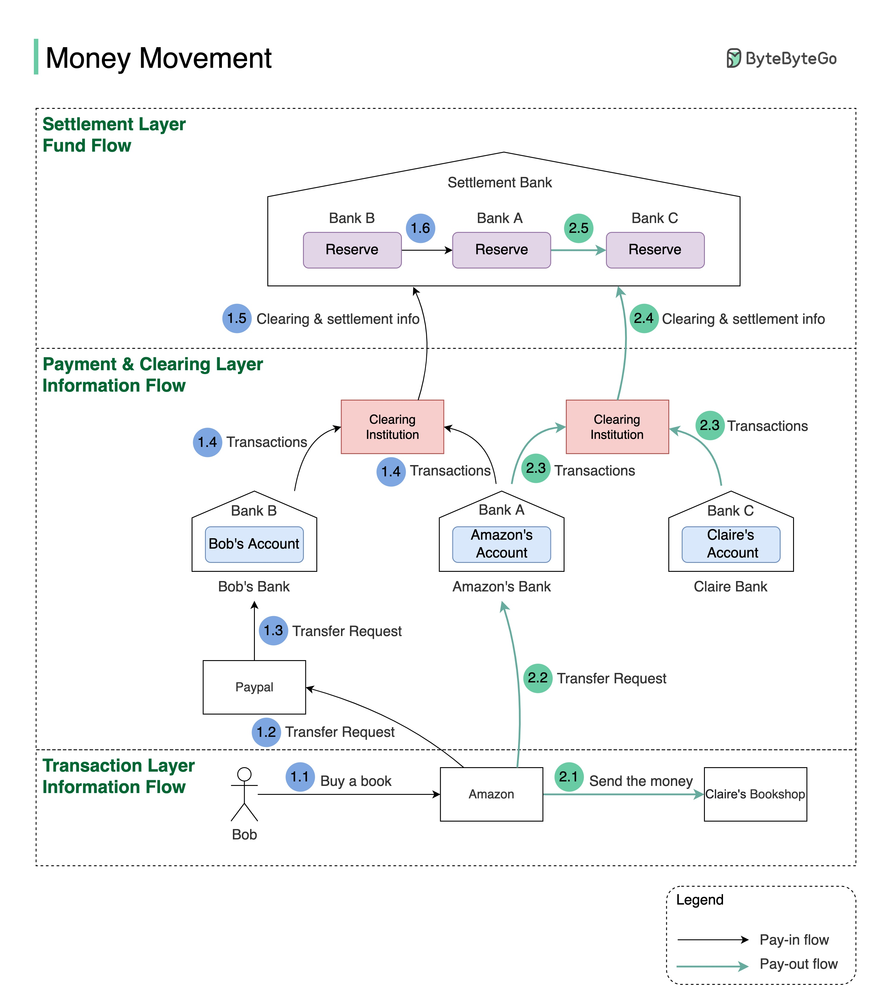

# 💰 网购付款后钱去哪了？资金流转全过程揭秘

> 清算、结算、信息流、资金流……一张图全搞懂

你在网上买东西付了款，钱是怎么从你的账户到卖家手里的？👇

📌 **Pay-in（买家付款）：**
1. Bob 在 Amazon 用 PayPal 买书
2. Amazon 向 PayPal 发起转账请求
3. PayPal 代 Bob 把钱转到 Amazon 在银行A的账户
4. 银行A和银行B把交易流水发给清算机构
5. 清算机构计算净头寸（比如A欠B $100，B欠A $500，净结算B付A $400）
6. 结算银行在两家银行的准备金账户间划转真实资金

📌 **Pay-out（平台付款给卖家）：**
1. Amazon 通知卖家 Claire 即将收到货款
2. Amazon 从银行A向卖家银行C发起转账
3. 同样经过清算和结算流程

📌 **三层架构：**
- **交易层** — 在线购买发生的地方
- **支付清算层** — 支付指令和交易轧差
- **结算层** — 真实资金划转

💡 **关键洞察：信息流和资金流是分离的。** 看起来钱立刻从一个账户到了另一个，但真实的资金划转是在结算银行日终批量完成的。这就是为什么对账如此重要。

你对支付系统感兴趣吗？👇

---

#支付 #金融科技 #清算结算 #系统设计 #后端 #FinTech #架构
