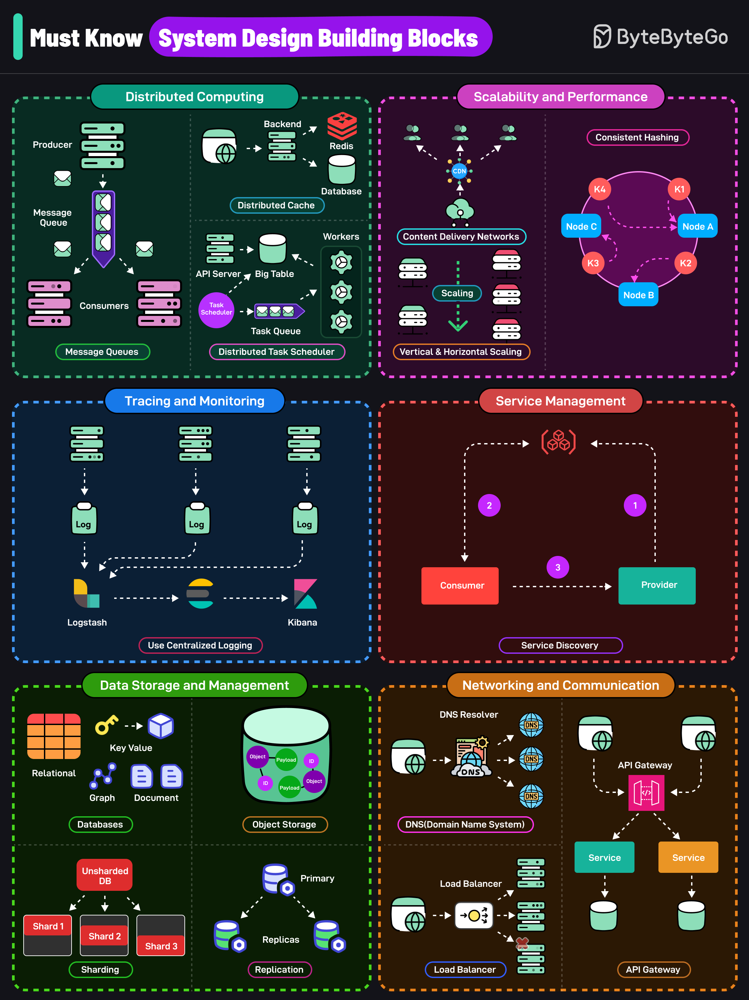

# 🧱 系统设计必知的6大模块！面试前必看

> 分布式计算、扩展性、存储……一张图全覆盖

系统设计面试绕不开这6大类核心组件 👇

📌 **分布式计算**
- 消息队列 — 异步通信，服务解耦
- 分布式缓存 — 热点数据存内存，提升性能
- 分布式任务调度 — 管理和协调任务执行

📌 **扩展性与性能**
- 服务扩缩容 — 按需调整容量
- CDN — 就近分发内容，降低延迟
- 一致性哈希 — 节点增减时最小化数据重映射

📌 **服务管理**
- 服务发现 — 服务间自动寻址，不用硬编码

📌 **网络与通信**
- DNS — 域名解析为IP
- 负载均衡 — 流量分发到多台服务器
- API网关 — 微服务的统一入口

📌 **数据存储与管理**
- 数据库 — 结构化数据存储
- 对象存储 — 图片、视频、文档
- 分片 — 水平拆分数据
- 副本 — 水平扩展读能力

📌 **可观测性与弹性**
- 指标、日志、链路追踪，洞察系统内部状态

💡 面试前把这些模块过一遍，系统设计题基本都在这个范围内。

你觉得哪个模块最难？👇

---

#系统设计 #面试 #分布式 #架构 #后端 #程序员 #缓存
