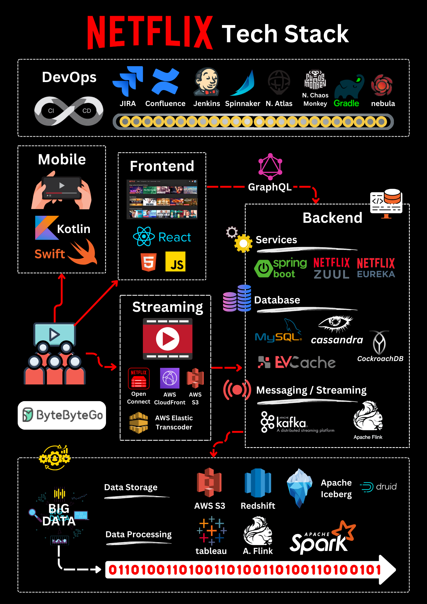

# 🎬 Netflix技术栈大揭秘！看看大厂都在用什么

> 从移动端到数据处理，Netflix的技术选型全公开

想知道 Netflix 用了哪些技术？一张图告诉你 👇

📌 **移动端** — Swift + Kotlin 原生开发
📌 **Web端** — React
📌 **API层** — GraphQL
📌 **后端框架** — Spring Boot + ZUUL + Eureka
📌 **缓存** — EVCache（基于Memcached）
📌 **数据库** — Cassandra + CockroachDB
📌 **消息** — Kafka + Flink
📌 **存储** — S3 + Open Connect
📌 **数据分析** — Spark + Flink + Tableau + Redshift
📌 **CI/CD** — Jenkins + Spinnaker + Chaos Monkey

💡 Netflix 的技术选型很有参考价值：成熟的开源方案 + 自研补充，每个环节都有明确的工具选择。

你的技术栈和 Netflix 有多少重合？👇

---

#Netflix #技术栈 #后端 #架构 #React #Kafka #Cassandra #程序员
