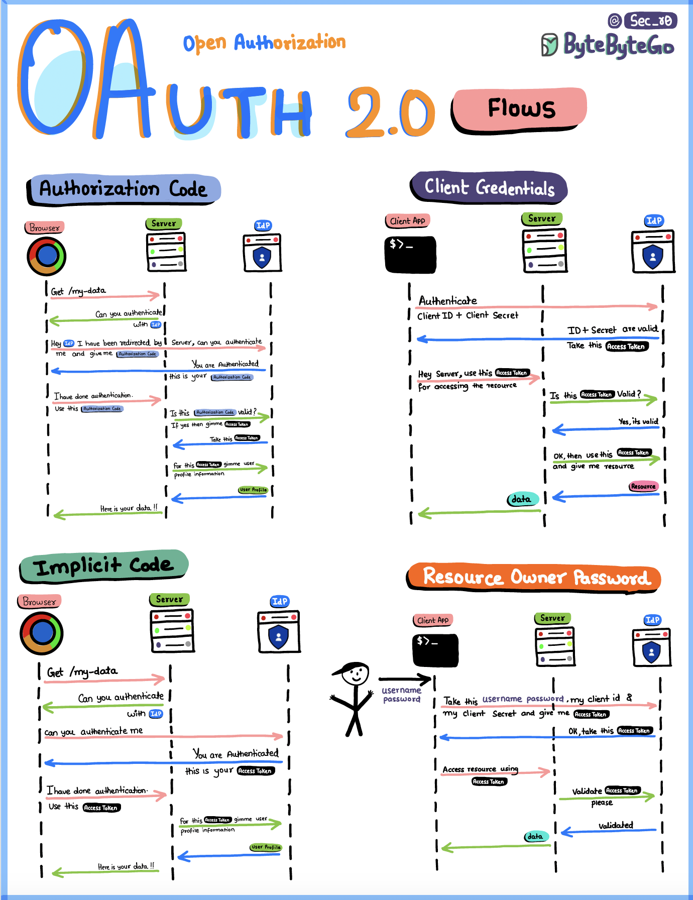

# 🔄 OAuth 2.0 四种授权流程详解！

> 不同场景用不同的Flow，别搞混了

OAuth 2.0 有多种授权流程，不同场景用不同的 👇

📌 **Authorization Code Flow（授权码模式）**
最常用的流程。用户认证后，客户端先拿到授权码，再用授权码换 Access Token 和 Refresh Token。最安全 ✅

📌 **Client Credentials Flow（客户端凭证模式）**
没有用户参与，服务端对服务端的场景。客户端直接用自己的凭证获取 Token

📌 **Implicit Flow（隐式模式）**
为单页应用（SPA）设计，Token 直接返回给客户端，没有中间的授权码步骤。安全性较低，逐渐被淘汰

📌 **Resource Owner Password Grant（密码模式）**
用户直接把用户名密码给客户端，客户端拿去换 Token。只适合高度信任的应用

💡 **怎么选？**
- Web应用 → Authorization Code
- 服务间调用 → Client Credentials
- SPA → Authorization Code + PKCE（替代Implicit）
- 密码模式 → 尽量别用

你的项目用的哪种 OAuth Flow？👇

---

#OAuth #授权 #认证 #安全 #后端 #API #面试 #程序员
