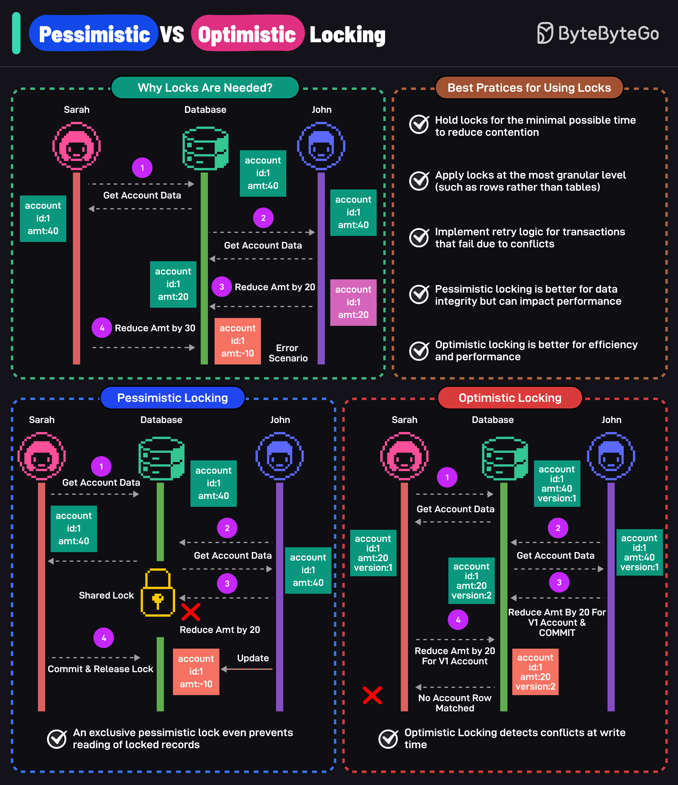

# 🔒 悲观锁 vs 乐观锁！并发控制必知必会

> 一张图搞懂两种锁的区别和使用场景

多用户同时修改数据怎么办？靠锁来保证一致性 👇

📌 **悲观锁（Pessimistic Locking）**
- 假设冲突一定会发生
- 修改前先加锁，其他人不能访问和修改
- 锁释放后才能操作
- 数据完整性强，但性能有影响

📌 **乐观锁（Optimistic Locking）**
- 假设冲突很少发生
- 允许多人同时访问数据
- 提交时检查是否有冲突，有冲突就回滚
- 性能好，但需要处理冲突

📌 **最佳实践：**
- 锁持有时间尽量短
- 锁粒度尽量细（锁行而不是锁表）
- 实现重试逻辑处理冲突失败
- 高冲突场景 → 悲观锁
- 低冲突场景 → 乐观锁

💡 简单记：悲观锁 = 先锁再改，乐观锁 = 先改再查。

你的项目用的哪种锁？👇

---

#数据库 #并发控制 #锁 #后端 #系统设计 #面试 #程序员
