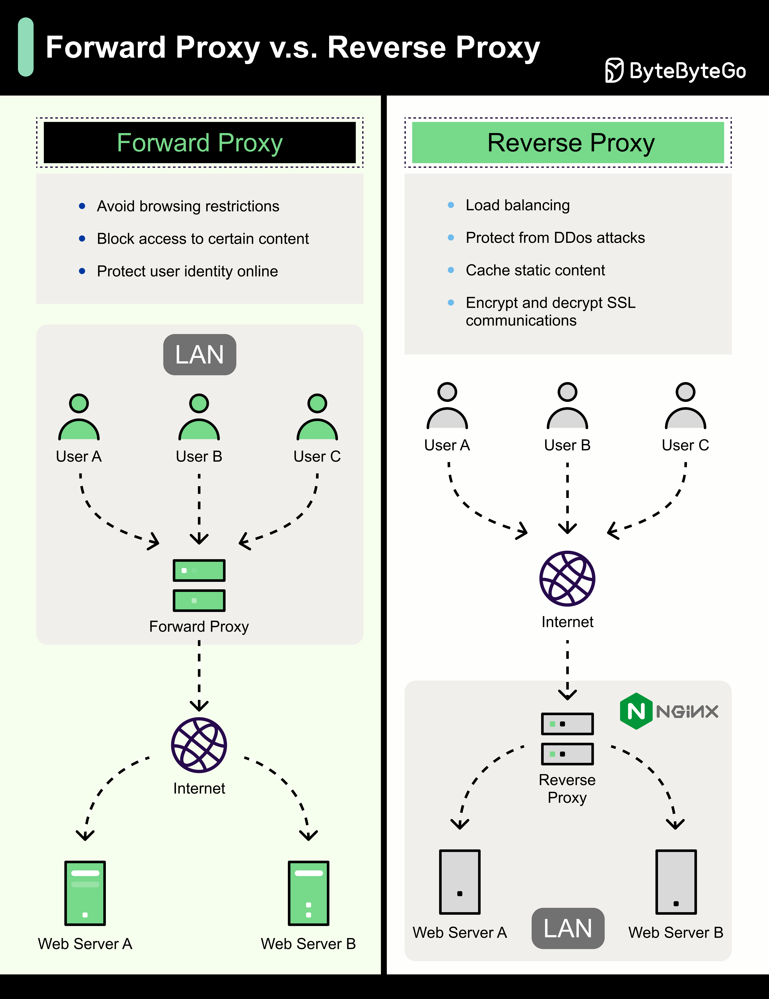

# 🔄 正向代理 vs 反向代理！一张图搞清区别

> 一个保护客户端，一个保护服务端

代理分两种，方向不同，用途也不同 👇

📌 **正向代理（Forward Proxy）**
位于用户和互联网之间，代表用户发请求
- 🛡️ 保护客户端隐私
- 🌐 绕过访问限制
- 🚫 屏蔽特定内容

📌 **反向代理（Reverse Proxy）**
位于互联网和服务器之间，代表服务器接收请求
- 🛡️ 保护服务器
- ⚖️ 负载均衡
- 💾 缓存静态内容
- 🔐 SSL加解密卸载

💡 **简单记：**
- 正向代理 = 客户端的代言人（VPN就是典型）
- 反向代理 = 服务端的代言人（Nginx就是典型）

你用过哪些代理工具？👇

---

#代理 #反向代理 #Nginx #网络 #系统设计 #后端 #面试
