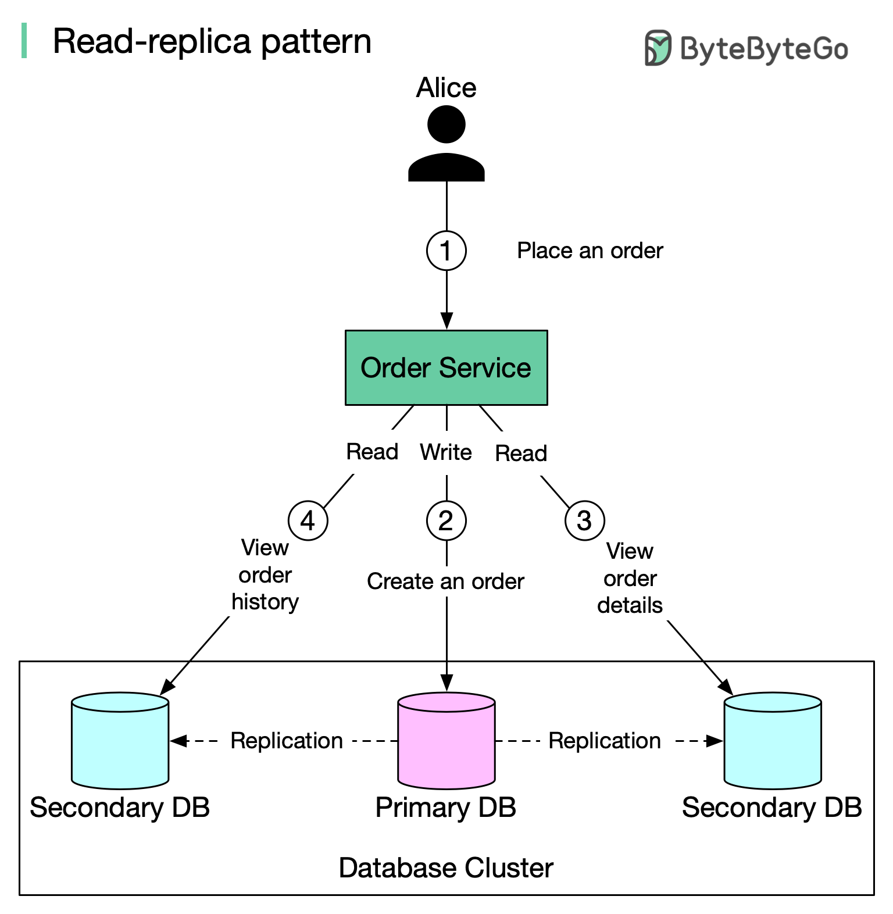

# 📖 读副本模式！数据库读写分离入门

> 写走主库，读走副本，但要小心复制延迟

数据库读多写少？读写分离是最常用的优化方案 👇

📌 **基本原理：**
- 所有写操作（INSERT/UPDATE/DELETE）→ 主库
- 所有读操作 → 读副本
- 数据从主库复制到副本

📌 **举个例子：**
1. Alice 下单 → 写入主库
2. 数据复制到两个副本
3. Alice 查看订单详情 → 从副本读取
4. Alice 查看历史订单 → 从副本读取

📌 **核心问题：复制延迟**
网络延迟或服务器过载时，副本数据可能落后几秒甚至几分钟。Alice 刚下完单就查，可能看不到订单！

📌 **解决方案：**
- 延迟敏感的读请求直接走主库
- 写操作后的立即读取路由到主库
- 检查副本是否已同步，未同步则走主库

💡 读写分离看起来简单，但"写后读一致性"是必须解决的问题。

你的项目做了读写分离吗？👇

---

#数据库 #读写分离 #主从复制 #系统设计 #后端 #MySQL #面试
