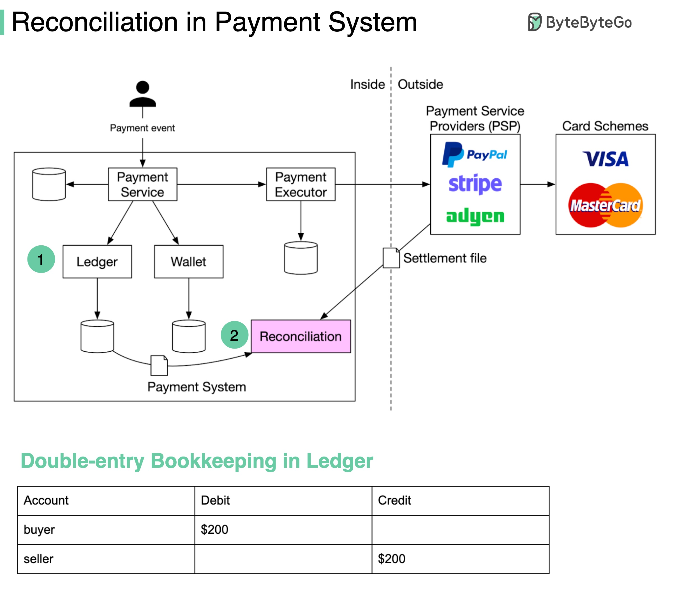

# 🧮 支付对账有多痛苦？3大难题和解决方案

> 对账是支付系统的安全网，少了它晚上睡不着

对账可能是支付系统里最头疼的环节——比对不同系统的记录，确保金额一致 👇

📌 **举个例子：**
你花 $200 在 PayPal 买了块手表：
- 电商网站有 $200 的订单记录
- PayPal 有 $200 的交易记录
- 账本记录：买家借记 $200，卖家贷记 $200（复式记账）

📌 **难题1：数据格式不统一**
一个系统时间戳是 "2022/01/01"，另一个是 "Jan 1, 2022"
→ 加一层格式转换层统一格式

📌 **难题2：数据量巨大**
→ 用大数据技术加速比对。近实时用 **Flink**，日终批处理用 **Hadoop**

📌 **难题3：截止时间问题**
内部系统记录 23:59:55，PayPal 记录 00:00:30（跨天了）
→ 标记为"临时差异"，第二天再比对，匹配上就自动消除

💡 就算系统做到了 exactly-once 语义，对账系统依然不可少。它是你的安全网。

你做过对账系统吗？最大的挑战是什么？👇

---

#支付 #对账 #FinTech #系统设计 #后端 #数据一致性 #架构
