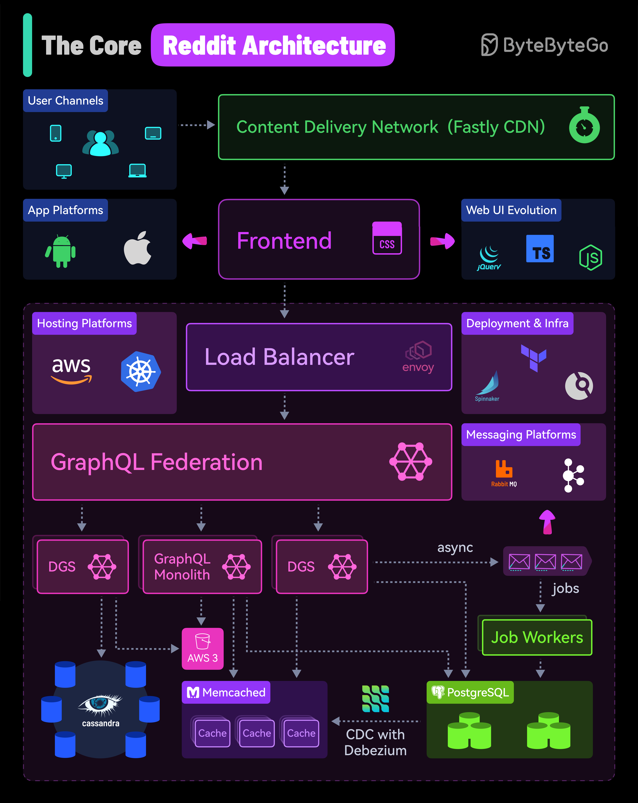

# 🔴 Reddit核心架构揭秘！月活10亿的社区怎么搭的？

> 从Python单体到Go微服务的演进之路

Reddit 每月服务超过 **10亿用户**，来看看它的架构 👇

📌 **前端** — CDN用Fastly，前端从jQuery → TypeScript → Node.js，还有Android/iOS原生App
📌 **负载均衡** — 位于应用栈最前面，路由请求到对应服务
📌 **后端** — 从Python单体逐步迁移到 **Go微服务**
📌 **API层** — 重度使用 **GraphQL**，2021年迁移到 GraphQL Federation，2022年拆分GraphQL单体
📌 **数据库** — **Postgres** 为核心，**Memcached** 做缓存，**Cassandra** 用于新功能
📌 **数据同步** — **Debezium** 做 CDC（变更数据捕获），维护缓存一致性
📌 **异步处理** — **RabbitMQ** 处理投票、提交等耗时操作，**Kafka** 做内容安全审核
📌 **基础设施** — AWS + Kubernetes，Spinnaker + Drone CI + Terraform

💡 Reddit 的架构演进很有代表性：从单体到微服务，从REST到GraphQL Federation，每一步都是为了解决实际的扩展性问题。

你最感兴趣的是哪个部分？👇

---

#Reddit #架构 #GraphQL #Go #微服务 #系统设计 #后端
