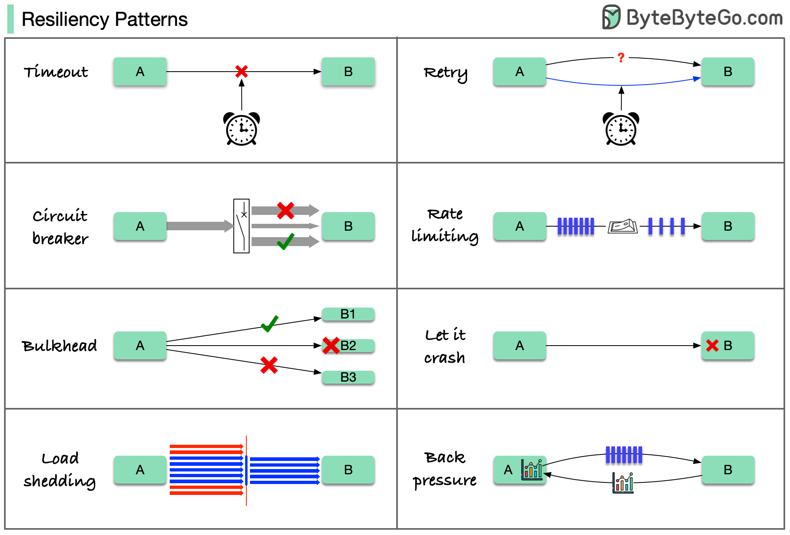

# 🛡️ 8种弹性设计模式！让系统不怕故障

> 最大的事故往往由最小的错误引发

一个小错误引发雪球效应，最终全系统崩溃。这8种模式帮你减少故障损害 👇

📌 **Timeout（超时）** — 设置请求超时，避免无限等待
📌 **Retry（重试）** — 失败后自动重试，应对临时故障
📌 **Circuit Breaker（熔断器）** — 故障达到阈值后断开，防止雪崩
📌 **Rate Limiting（限流）** — 控制请求速率，保护系统不被打爆
📌 **Load Shedding（负载卸载）** — 过载时主动丢弃部分请求
📌 **Bulkhead（舱壁隔离）** — 隔离故障，防止一个模块拖垮整个系统
📌 **Back Pressure（背压）** — 下游处理不过来时通知上游减速
📌 **Let it Crash（任其崩溃）** — 快速失败，快速重启，比苟延残喘更好

💡 这些模式通常不单独使用，而是组合搭配。理解每个模式的原理和局限性才能用好它们。

你的系统用了哪些弹性模式？👇

---

#弹性设计 #熔断器 #限流 #系统设计 #分布式 #后端 #面试
