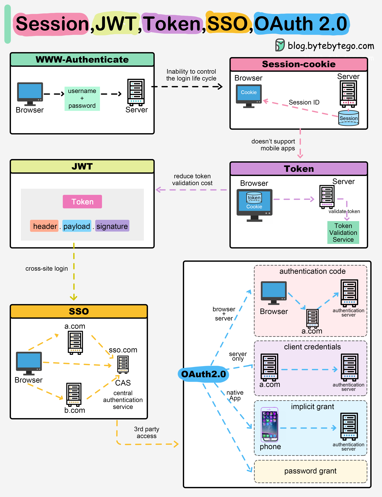

# 🔑 Session、Cookie、JWT、SSO、OAuth 2.0 一图全搞懂！

> 登录认证的6种方案，面试必考

登录网站后，你的身份是怎么被管理的？6种方案一次讲清 👇

📌 **Session** — 服务端存身份信息，给浏览器一个Session ID Cookie。服务端可追踪状态，但跨设备不友好

📌 **Token** — 身份信息编码成Token发给浏览器，后续请求带上Token认证。服务端不用存Session，但需要加解密

📌 **JWT** — 标准化的Token方案，用数字签名保证可信。签名在Token里，不需要服务端Session

📌 **SSO（单点登录）** — 用一个中心认证服务，一次登录多个站点通用

📌 **OAuth 2.0** — 允许一个网站有限度地访问你在另一个网站的数据，不用给密码

📌 **QR Code** — 把随机Token编码成二维码，扫码登录，不用输密码

💡 面试常问：Session和JWT的区别？答案核心就是有状态vs无状态。

你的项目用的哪种认证方案？👇

---

#认证 #JWT #Session #OAuth #SSO #安全 #面试 #后端
