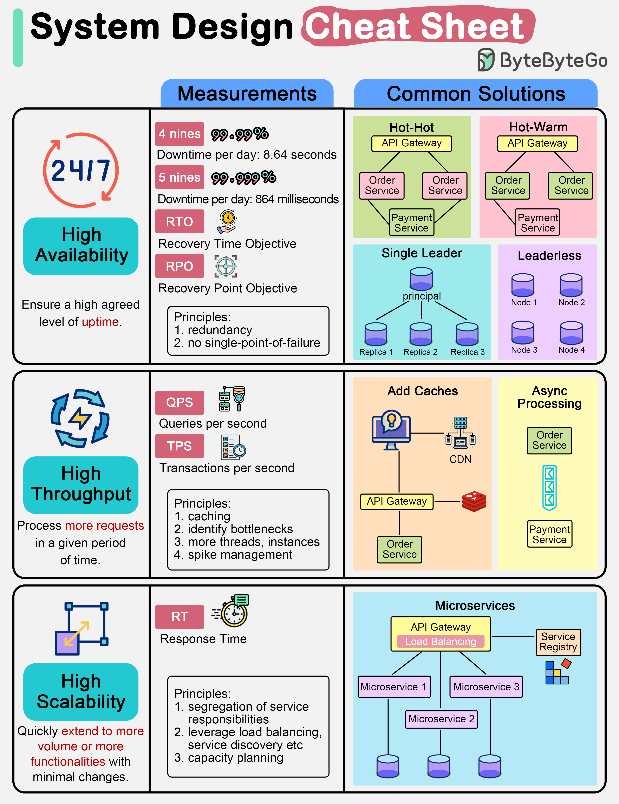

# 📋 系统设计速查表！高可用、高吞吐、高扩展怎么做？

> 面试常问的三高设计，一张图给你答案

系统设计面试总被问"三高"，到底怎么实现？👇

📌 **高可用（High Availability）**
目标：99.99% 可用 = 每天最多宕机8.64秒
- **Hot-Hot** — 双实例同时工作，一个挂了另一个立刻接管
- **Hot-Warm** — 热备，主实例挂了备用接管
- **单主集群** — 一个Leader接收写入，复制到副本
- **无主集群** — 没有Leader，写入复制到多个实例

📌 **高吞吐（High Throughput）**
目标：处理大量QPS/TPS
- 加缓存，避免请求打到慢IO设备
- 增加线程数（但别加太多）
- 找到瓶颈，针对性优化
- 异步处理隔离重计算组件

📌 **高扩展（High Scalability）**
- 水平扩展 — 加更多机器
- 垂直扩展 — 加更多功能
- 监控响应时间决定是否需要扩展

💡 三高不是独立的，往往需要综合考虑。收藏这张速查表，面试前翻一翻。

你觉得三高里哪个最难实现？👇

---

#系统设计 #高可用 #高并发 #架构 #面试 #后端 #分布式
