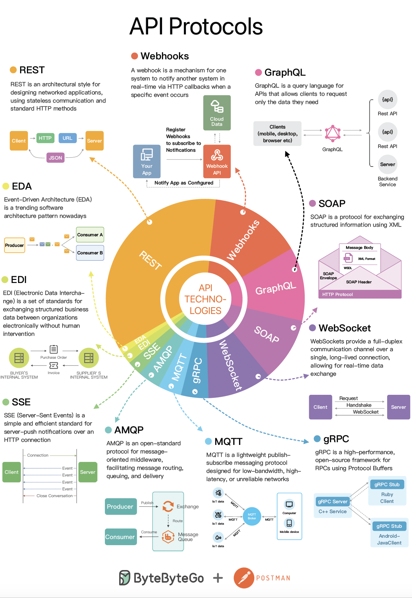

# 🌐 2023年API协议全景图！6大主流协议对比

> REST、GraphQL、gRPC、WebSocket……各有什么优劣？

6种最流行的API协议，各有各的适用场景 👇

📌 **REST** — 最主流，基于HTTP，简单通用
📌 **Webhooks** — 事件驱动，服务端主动推送
📌 **GraphQL** — 客户端按需查询，前端友好
📌 **SOAP** — 企业级标准，严格规范
📌 **WebSocket** — 全双工实时通信
📌 **gRPC** — 高性能RPC，微服务间通信首选

💡 没有万能的协议，关键是匹配你的业务场景。了解每种协议的优劣势才能做出正确选择。

你的项目用了哪几种？👇

---

#API #REST #GraphQL #gRPC #WebSocket #后端 #系统设计
