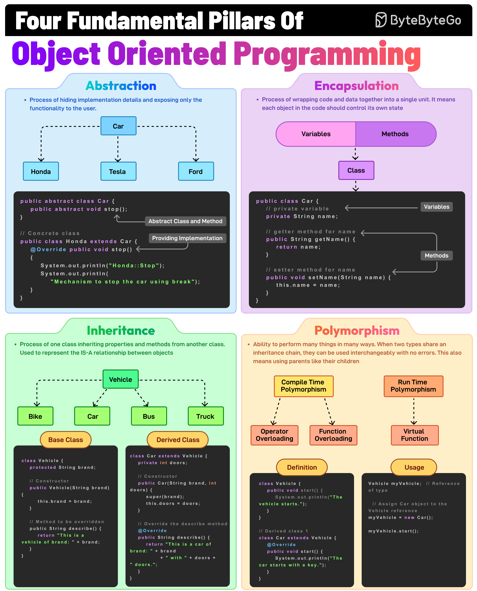

# 🏛️ 面向对象四大支柱！抽象、封装、继承、多态

> OOP的核心概念，面试必考

面向对象编程的4个核心概念，每个都要搞懂 👇

📌 **抽象（Abstraction）**
隐藏实现细节，只暴露必要功能。比如 Vehicle 类有一个抽象的 stop() 方法，具体怎么停由子类决定

📌 **封装（Encapsulation）**
把数据和方法包在一个类里，用访问修饰符限制直接访问。比如 private 字段 + public getter/setter

📌 **继承（Inheritance）**
子类继承父类的属性和方法，促进代码复用。比如 Car 继承 Vehicle

📌 **多态（Polymorphism）**
同一个方法在不同对象上有不同行为。共享继承链的类型可以互换使用

💡 这四个概念是 OOP 的基石，理解了它们才能写出好的面向对象代码。面试时能举出实际例子更加分。

你能用一句话解释多态吗？👇

---

#OOP #面向对象 #Java #编程 #面试 #软件设计 #程序员
