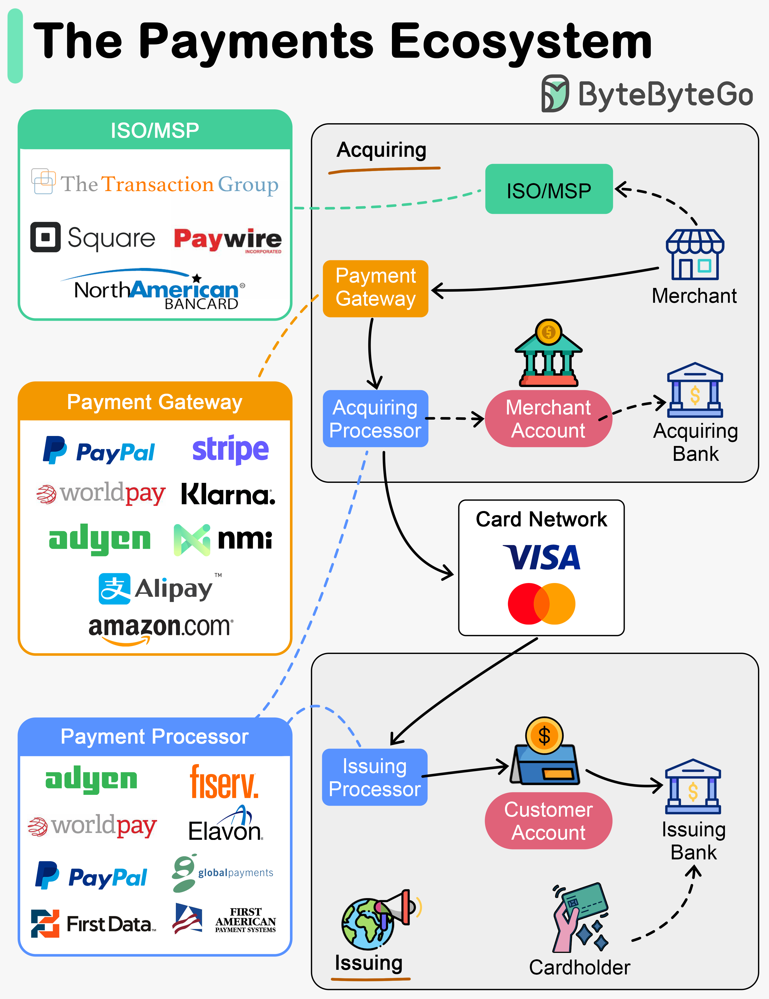

# 💳 支付生态全景图！PayPal、Stripe、Square到底在做什么？

> 从持卡人到发卡行，支付链路上的每个角色

支付行业这么多公司，它们各自扮演什么角色？👇

📌 **开户阶段（Step 0-1）**
- 持卡人在发卡行开户，获得借记卡/信用卡
- 商户通过 ISO/MSP 注册，开通商户账户

📌 **收单流程（Step 2-5）**
- **支付网关** — 接收交易，收集支付信息
- **支付处理器** — 用客户信息完成收款
- **收单处理器** — 把交易发送到卡组织，管理商户账户结算

📌 **发卡流程（Step 6-8）**
- **发卡处理器** — 代表发卡行与卡组织通信
- 验证交易，操作客户账户

📌 **行业特点：**
支付公司通常从一个垂直领域起步，然后扩展到多个领域

💡 理解支付生态的每个环节，才能发现新的商业机会。

你对支付行业的哪个环节最感兴趣？👇

---

#支付 #FinTech #Stripe #PayPal #系统设计 #金融 #架构
