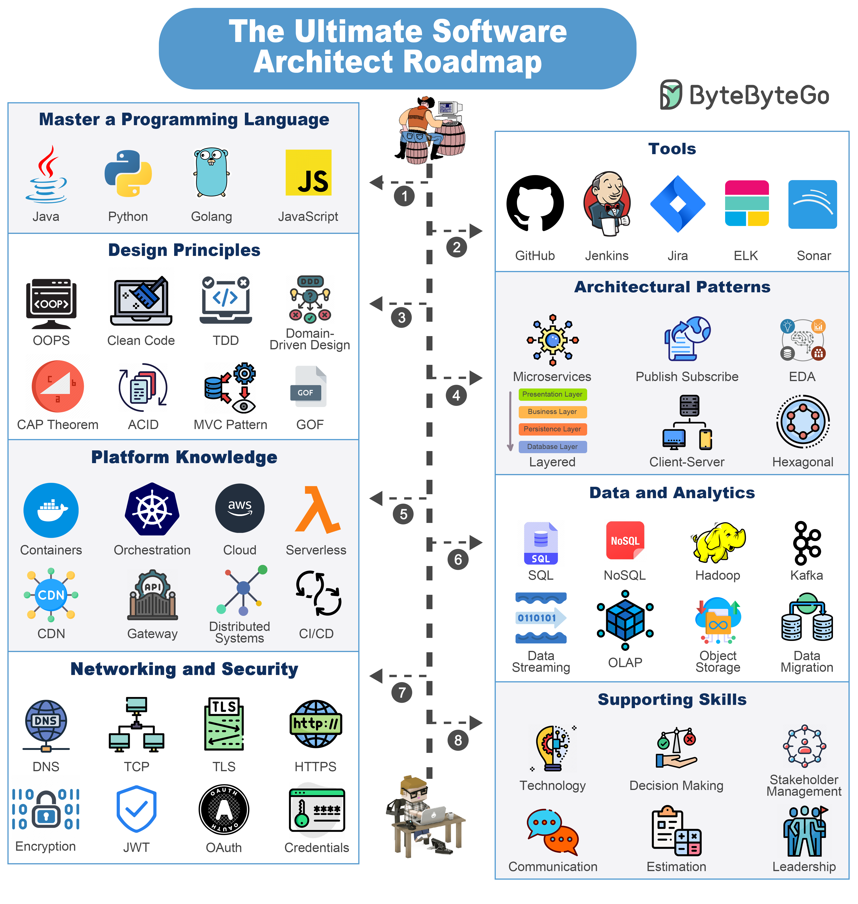

# 🗺️ 软件架构师知识地图！成为架构师要学什么？

> 编程语言、设计原则、架构模式……全覆盖

想成为软件架构师？这张知识地图告诉你需要掌握什么 👇

📌 **编程语言** — 精通1-2门：Java、Python、Go、JS
📌 **工具** — GitHub、Jenkins、Jira、ELK、Sonar
📌 **设计原则** — OOP、Clean Code、TDD、DDD、CAP、MVC、ACID、GoF
📌 **架构模式** — 微服务、发布订阅、分层、事件驱动、六边形架构
📌 **平台知识** — 容器、编排、云、Serverless、CDN、API网关、分布式、CI/CD
📌 **数据分析** — SQL/NoSQL、Kafka、对象存储、数据迁移、OLAP
📌 **网络安全** — DNS、TCP、TLS、HTTPS、加密、JWT、OAuth
📌 **软技能** — 决策力、技术视野、沟通、评估、领导力

💡 架构师是一个持续学习的旅程，不用一次全学会，但要知道方向在哪。

你觉得架构师最重要的能力是什么？👇

---

#架构师 #软件架构 #职业发展 #后端 #系统设计 #程序员 #学习路线
