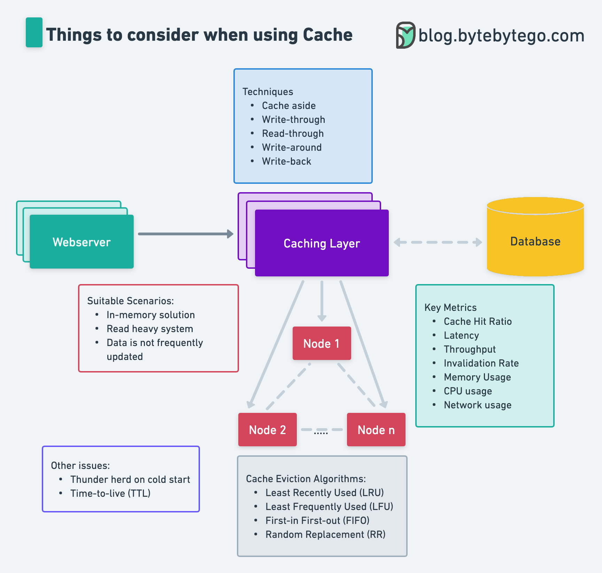

# 💡 用缓存前必须考虑的5件事！别踩坑

> 缓存策略、淘汰算法、关键指标……一张图搞定

缓存是提升系统性能的利器，但用之前这5件事要想清楚 👇

📌 **适用场景**
- 内存方案
- 读多写少
- 数据不频繁更新

📌 **缓存策略**
- Cache Aside / Write-through / Read-through / Write-around / Write-back

📌 **淘汰算法**
- LRU（最近最少使用）
- LFU（最不经常使用）
- FIFO（先进先出）
- 随机替换

📌 **关键指标**
- 命中率、延迟、吞吐量、失效率、内存/CPU/网络使用率

📌 **其他问题**
- 冷启动时的惊群效应
- TTL（过期时间）设置

💡 缓存用好了是加速器，用不好就是bug制造机。上线前把这5点过一遍。

你踩过缓存的什么坑？👇

---

#缓存 #Redis #性能优化 #系统设计 #后端 #架构 #面试
