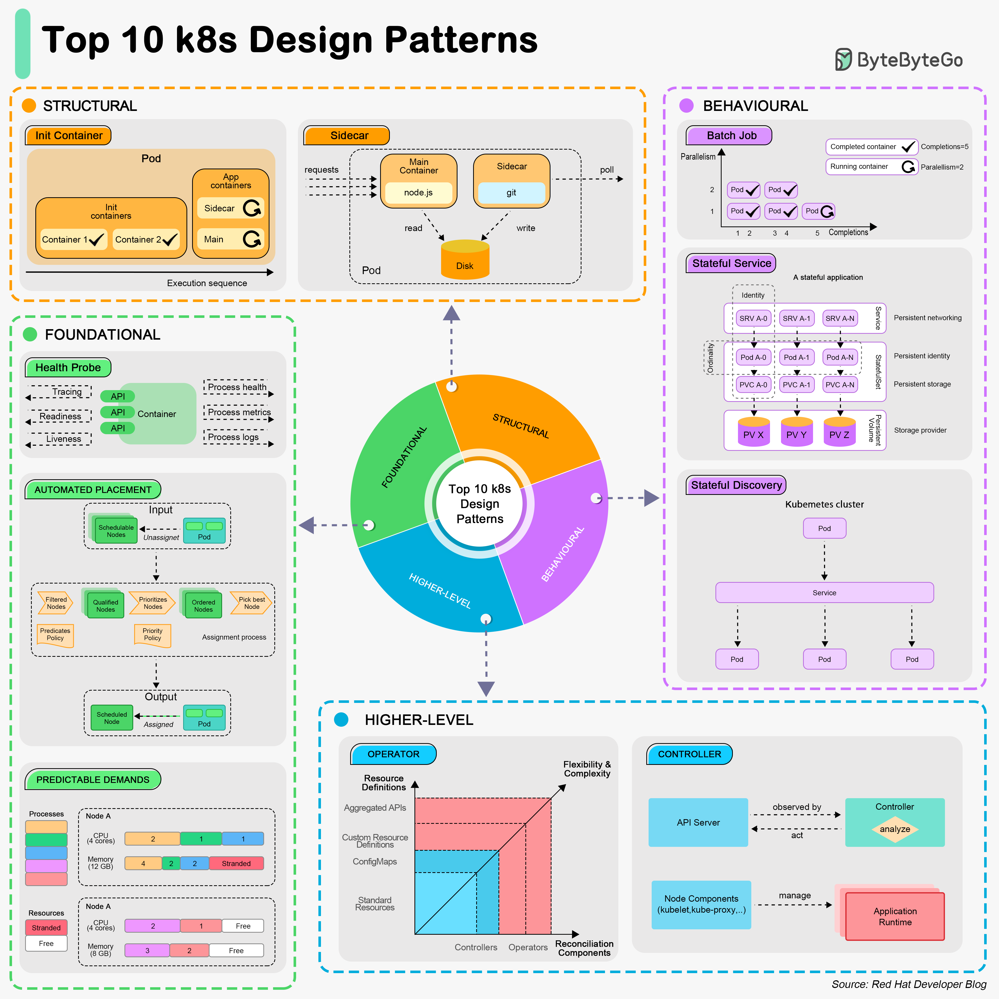

# 🎯 K8s十大设计模式！容器编排的最佳实践

> 基础模式、结构模式、行为模式、高级模式全覆盖

Kubernetes 的10大设计模式，按层级分类 👇

📌 **基础模式**
- **Health Probe** — 每个容器必须实现可观测API
- **Predictable Demands** — 声明资源需求和运行时依赖
- **Automated Placement** — K8s调度算法的原则

📌 **结构模式**
- **Init Container** — 初始化任务有独立的生命周期
- **Sidecar** — 不修改容器本身，扩展其功能

📌 **行为模式**
- **Batch Job** — 管理独立的原子工作单元
- **Stateful Service** — 创建分布式有状态应用
- **Service Discovery** — 客户端如何发现服务

📌 **高级模式**
- **Controller** — 监控当前状态，与目标状态对齐
- **Operator** — 把运维知识编码成自动化形式

💡 这些模式是 K8s 应用开发的最佳实践，掌握了能让你的容器化应用更健壮。

你用过哪些模式？👇

---

#Kubernetes #K8s #设计模式 #云原生 #DevOps #容器 #架构
