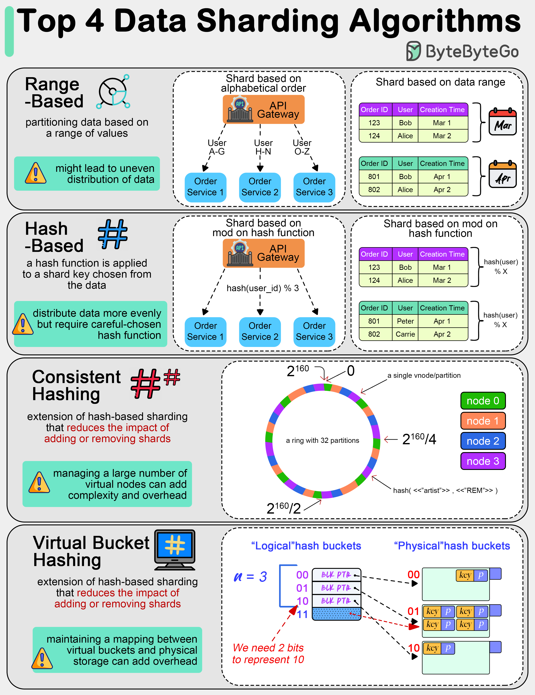

# 🔀 4种数据分片算法详解！海量数据怎么拆？

> 范围分片、哈希分片、一致性哈希、虚拟桶

数据量太大需要拆分到多个分片，4种常用算法 👇

📌 **范围分片（Range-Based）**
按值的范围分，比如按姓氏字母、按日期区间。简单直观但可能分布不均

📌 **哈希分片（Hash-Based）**
对分片键做哈希运算，数据分布更均匀。但要选好哈希函数避免碰撞

📌 **一致性哈希（Consistent Hashing）**
哈希分片的升级版，增删分片时影响最小，数据迁移量少

📌 **虚拟桶分片（Virtual Bucket）**
数据先映射到虚拟桶，虚拟桶再映射到物理分片。两级映射，重平衡更灵活

💡 一致性哈希和虚拟桶是大规模分布式系统的首选，能优雅地处理扩缩容。

你们的分片方案用的哪种算法？👇

---

#分片 #分库分表 #一致性哈希 #数据库 #系统设计 #后端 #面试
