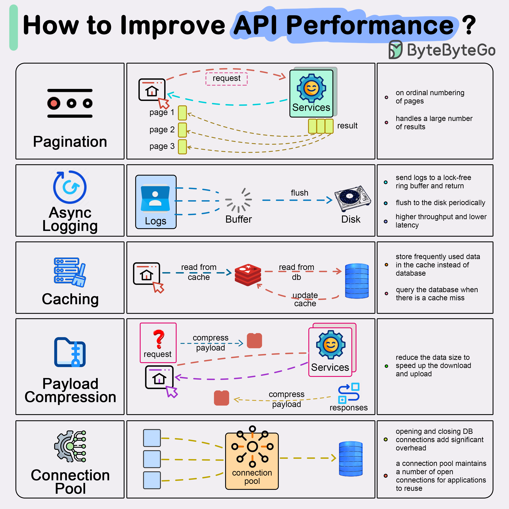

# ⚡ 提升API性能的5种常用方法！

> 分页、异步日志、缓存、压缩、连接池

API 响应慢？试试这5种优化方法 👇

📌 **结果分页** — 大结果集流式返回，提升响应速度和用户体验
📌 **异步日志** — 日志写入无锁缓冲区立即返回，定期刷盘，大幅减少IO开销
📌 **数据缓存** — 热点数据存Redis等内存缓存，先查缓存再查数据库
📌 **数据压缩** — 请求和响应用gzip压缩，减少传输时间
📌 **连接池** — 复用数据库连接，避免每次请求都开关连接的开销

💡 这5种方法可以叠加使用，效果更明显。先用监控找到瓶颈，再针对性优化。

你用过哪些API优化技巧？👇

---

#API #性能优化 #缓存 #Redis #后端 #系统设计 #面试
